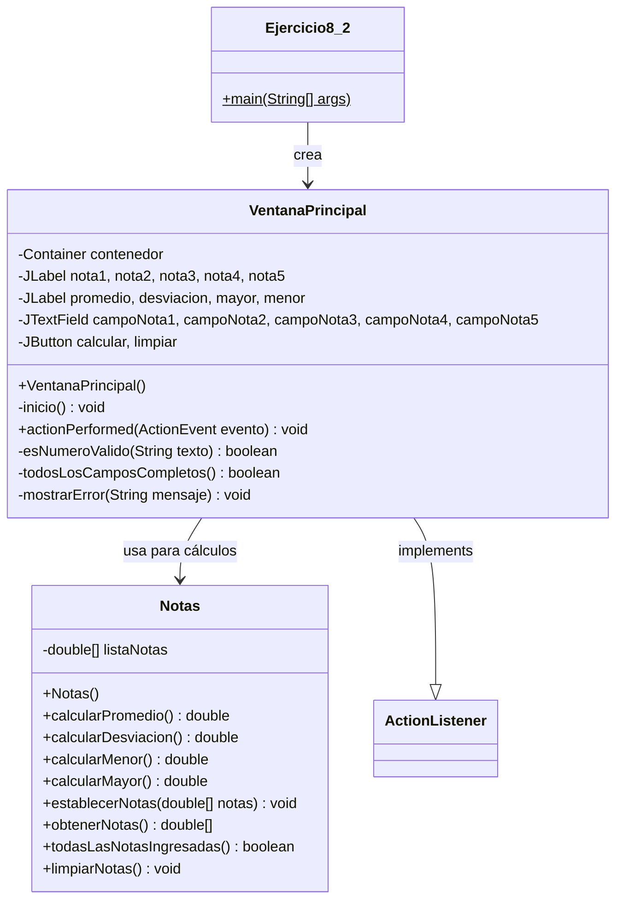

# Documentación - Ejercicio 8.2: Componentes Swing (Notas)

## Descripción General

Este ejercicio implementa una aplicación de escritorio con interfaz gráfica de usuario (GUI) utilizando componentes Swing de Java. La aplicación permite ingresar cinco notas de un estudiante y calcular estadísticas básicas como promedio, desviación estándar, nota mayor y nota menor.

## Objetivos de Aprendizaje

Al finalizar este ejercicio, el estudiante tendrá la capacidad para:

- Conocer y aplicar diversos componentes swing para desarrollar interfaces gráficas de usuario
- Realizar una gestión básica de los eventos generados mediante la interacción con los diferentes componentes swing
- Implementar validación de datos de entrada
- Manejar mensajes de error y alertas al usuario

## Casos de Uso

### CU1: Ingresar Notas del Estudiante
**Actor:** Usuario (Estudiante/Profesor)
**Descripción:** El usuario desea ingresar las cinco notas obtenidas por un estudiante.

**Flujo Principal:**
1. El usuario inicia la aplicación
2. El sistema muestra la ventana principal con cinco campos de texto
3. El usuario ingresa cada nota en los campos correspondientes
4. El sistema valida que cada nota sea un número válido entre 0.0 y 5.0
5. El usuario puede continuar al caso de uso CU2

**Flujos Alternativos:**
- 4a. Si alguna nota no es válida, el sistema muestra un mensaje de error específico
- 4b. Si algún campo está vacío, el sistema muestra un mensaje indicando que todos los campos son obligatorios

### CU2: Calcular Estadísticas de Notas
**Actor:** Usuario (Estudiante/Profesor)
**Descripción:** El usuario desea calcular el promedio, desviación estándar, nota mayor y nota menor de las notas ingresadas.

**Flujo Principal:**
1. El usuario presiona el botón "Calcular"
2. El sistema valida que todas las notas estén ingresadas y sean válidas
3. El sistema realiza los cálculos estadísticos
4. El sistema muestra los resultados en la parte inferior de la ventana
5. El usuario puede ver los resultados calculados

**Flujos Alternativos:**
- 2a. Si hay errores de validación, el sistema muestra mensajes de error apropiados
- 2b. Si ocurre un error inesperado, el sistema muestra un mensaje de error genérico

### CU3: Limpiar Campos
**Actor:** Usuario (Estudiante/Profesor)
**Descripción:** El usuario desea limpiar todos los campos de entrada y resultados para ingresar nuevas notas.

**Flujo Principal:**
1. El usuario presiona el botón "Limpiar"
2. El sistema borra todos los campos de entrada
3. El sistema borra todos los resultados mostrados
4. La ventana queda lista para ingresar nuevas notas

## Diagramas de Clase

### Diagrama de Clases Principal



### Diagrama de Objetos

```mermaid
classDiagram
    class "miVentanaPrincipal: VentanaPrincipal" as VentanaObj {
        +contenedor: Container
        +nota1: JLabel "Nota 1:"
        +nota2: JLabel "Nota 2:"
        +nota3: JLabel "Nota 3:"
        +nota4: JLabel "Nota 4:"
        +nota5: JLabel "Nota 5:"
        +campoNota1: JTextField
        +campoNota2: JTextField
        +campoNota3: JTextField
        +campoNota4: JTextField
        +campoNota5: JTextField
        +calcular: JButton "Calcular"
        +limpiar: JButton "Limpiar"
        +promedio: JLabel "Promedio = "
        +desviacion: JLabel "Desviación = "
        +mayor: JLabel "Nota mayor = "
        +menor: JLabel "Nota menor = "
    }
    
    class "notas: Notas" as NotasObj {
        +listaNotas: double[5]
    }
    
    VentanaObj --> NotasObj : 1..1
```

## Ejercicios Propuestos Resueltos

### Ejercicio Propuesto 1: Validación de Datos Numéricos
**Solución Implementada:**
- Método `esNumeroValido(String texto)` que valida:
  - Que el texto no sea nulo o vacío
  - Que sea un número válido (usando `Double.parseDouble()`)
  - Que esté en el rango válido de notas (0.0 a 5.0)
- Uso de `try-catch` para manejar `NumberFormatException`
- Mensajes de error específicos indicando qué nota tiene el problema

### Ejercicio Propuesto 2: Verificación de Campos Obligatorios
**Solución Implementada:**
- Método `todosLosCamposCompletos()` que verifica:
  - Que ningún campo de texto esté vacío
  - Que todos los campos tengan contenido
- Validación antes de realizar cálculos
- Mensaje de error claro indicando que se deben ingresar las cinco notas

## Componentes Swing Utilizados

| Componente | Propósito | Ubicación en la Ventana |
|------------|-----------|-------------------------|
| `JFrame` | Ventana principal de la aplicación | Contenedor principal |
| `Container` | Contenedor de componentes gráficos | Panel de contenido |
| `JLabel` | Etiquetas de texto estático | Etiquetas de notas y resultados |
| `JTextField` | Campos de entrada de texto | Campos para ingresar notas |
| `JButton` | Botones interactivos | Botones "Calcular" y "Limpiar" |
| `JOptionPane` | Diálogos de mensaje | Mensajes de error y alertas |

## Métodos de Validación y Manejo de Errores

### Validación de Entrada
- **Rango de notas:** 0.0 a 5.0
- **Formato numérico:** Acepta decimales con punto
- **Campos obligatorios:** Todos los campos deben estar completos

### Mensajes de Error
- **Campo vacío:** "Debe ingresar las cinco notas. Ningún campo puede estar vacío."
- **Formato inválido:** "Error en la Nota X: Debe ingresar un número válido entre 0.0 y 5.0"
- **Error inesperado:** "Error inesperado: [descripción del error]"

## Mejoras Implementadas

1. **Corrección del Bug Original:** El bucle en `calcularPromedio()` ahora inicia en `i=0` en lugar de `i=1`
2. **Encapsulamiento:** Los atributos de la clase `Notas` son privados con métodos públicos para acceso
3. **Manejo de Hilos:** Uso de `SwingUtilities.invokeLater()` para crear la GUI en el hilo de eventos
4. **Validación Robusta:** Validación completa de entrada de datos
5. **Mensajes de Error Informativos:** Mensajes específicos para cada tipo de error
6. **Formato de Salida:** Resultados formateados con decimales apropiados

## Instrucciones de Compilación y Ejecución

### Requisitos
- Java 17 o superior
- Apache Maven 3.8+

### Compilación
```bash
mvn clean compile
```

### Ejecución
```bash
mvn exec:java
```

### Desde NetBeans
1. Abrir el proyecto `Ejercicio8_2`
2. Hacer clic derecho en el proyecto
3. Seleccionar "Run Project"

## Estructura del Proyecto

```
Ejercicio8_2/
├── pom.xml
├── DOCUMENTATION.md
└── src/
    └── main/
        └── java/
            └── unal/
                └── ejercicio8_2/
                    ├── Ejercicio8_2.java      # Clase principal
                    ├── VentanaPrincipal.java  # Interfaz gráfica
                    └── Notas.java            # Lógica de cálculos
```
