# Documentación - Ejercicio 8.3: Gestión de Eventos (Figuras Geométricas)

## Descripción General

Este ejercicio implementa una aplicación de escritorio con interfaz gráfica de usuario (GUI) que permite calcular el volumen y superficie de varias figuras geométricas. La aplicación utiliza componentes Swing de Java y demuestra la gestión de eventos mediante la implementación de listeners. Las figuras incluyen el cilindro, la esfera, la pirámide, y como extensiones del ejercicio propuesto: el cubo y el prisma.

## Objetivos de Aprendizaje

Al finalizar este ejercicio, el estudiante tendrá la capacidad para:

- Definir oyentes o listeners para el tratamiento de eventos generados mediante la interacción de usuario en la interfaz gráfica
- Implementar interfaces ActionListener para gestionar eventos de botones
- Crear una jerarquía de clases para diferentes figuras geométricas utilizando herencia
- Desarrollar interfaces gráficas con Swing y manejo de eventos
- Manejar excepciones en la entrada de datos y validación de formularios

## Casos de Uso

### CU1: Seleccionar Figura Geométrica
**Actor:** Usuario (Estudiante/Profesor)
**Descripción:** El usuario desea seleccionar una figura geométrica para calcular su volumen y superficie.

**Flujo Principal:**
1. El usuario inicia la aplicación
2. El sistema muestra la ventana principal con cinco botones de figuras geométricas
3. El usuario hace clic en uno de los botones (Cilindro, Esfera, Pirámide, Cubo, Prisma)
4. El sistema abre la ventana correspondiente a la figura seleccionada
5. El usuario puede continuar al caso de uso CU2

### CU2: Calcular Volumen y Superficie de Figura
**Actor:** Usuario (Estudiante/Profesor)
**Descripción:** El usuario desea calcular el volumen y superficie de la figura geométrica seleccionada.

**Flujo Principal:**
1. El usuario ingresa los parámetros requeridos para la figura:
   - **Cilindro**: Radio y altura
   - **Esfera**: Radio
   - **Pirámide**: Base, altura y apotema
   - **Cubo**: Arista
   - **Prisma**: Base, altura y número de lados
2. El usuario presiona el botón "Calcular"
3. El sistema valida que todos los campos estén completos y sean válidos
4. El sistema realiza los cálculos matemáticos correspondientes
5. El sistema muestra los resultados (volumen y superficie) en la ventana
6. El sistema muestra una representación gráfica de la figura
7. El usuario puede ver los resultados y la imagen de la figura

**Flujos Alternativos:**
- 3a. Si hay campos vacíos, el sistema muestra mensaje "Campo nulo o error en formato de número"
- 3b. Si el formato numérico es incorrecto, el sistema muestra mensaje de error
- 3c. Si el número de lados del prisma es menor a 3, el sistema muestra mensaje de error

### CU3: Cerrar Ventana de Figura
**Actor:** Usuario (Estudiante/Profesor)
**Descripción:** El usuario desea cerrar la ventana de la figura y regresar al menú principal.

**Flujo Principal:**
1. El usuario presiona el botón de cerrar (X) de la ventana de la figura
2. El sistema oculta la ventana de la figura
3. El usuario regresa a la ventana principal
4. El usuario puede seleccionar otra figura o cerrar la aplicación

### CU4: Cerrar Aplicación
**Actor:** Usuario (Estudiante/Profesor)
**Descripción:** El usuario desea cerrar completamente la aplicación.

**Flujo Principal:**
1. El usuario presiona el botón de cerrar (X) de la ventana principal
2. El sistema cierra todas las ventanas abiertas
3. El sistema termina la ejecución de la aplicación

## Estructura del Proyecto

### Clases Principales

#### 1. FiguraGeometrica (Clase Base)
- **Propósito**: Clase abstracta base para todas las figuras geométricas
- **Atributos**: 
  - `volumen`: double - Volumen de la figura
  - `superficie`: double - Superficie de la figura
- **Métodos**:
  - `setVolumen(double)`: void
  - `setSuperficie(double)`: void
  - `getVolumen()`: double
  - `getSuperficie()`: double

#### 2. Figuras Geométricas Específicas

##### Cilindro
- **Parámetros**: Radio y altura (en centímetros)
- **Fórmulas**:
  - Volumen: π × altura × radio²
  - Superficie: 2π × radio × altura + 2π × radio²

##### Esfera
- **Parámetros**: Radio (en centímetros)
- **Fórmulas**:
  - Volumen: (4/3) × π × radio³
  - Superficie: 4π × radio²

##### Pirámide
- **Parámetros**: Base, altura y apotema (en centímetros)
- **Fórmulas**:
  - Volumen: (base² × altura) / 3
  - Superficie: base² + 2 × base × apotema

##### Cubo (Extensión)
- **Parámetros**: Arista (en centímetros)
- **Fórmulas**:
  - Volumen: arista³
  - Superficie: 6 × arista²

##### Prisma (Extensión)
- **Parámetros**: Base, altura y número de lados
- **Fórmulas**:
  - Volumen: área_base × altura
  - Superficie: 2 × área_base + área_lateral

#### 3. Clases de Interfaz Gráfica

##### VentanaPrincipal
- **Propósito**: Ventana principal con menú de selección de figuras
- **Componentes**: 5 botones (Cilindro, Esfera, Pirámide, Cubo, Prisma)
- **Eventos**: ActionListener para cada botón

##### Ventanas Específicas
- **VentanaCilindro**: Interfaz para cálculos de cilindro
- **VentanaEsfera**: Interfaz para cálculos de esfera
- **VentanaPiramide**: Interfaz para cálculos de pirámide
- **VentanaCubo**: Interfaz para cálculos de cubo
- **VentanaPrisma**: Interfaz para cálculos de prisma

#### 4. Clase de Visualización

##### ImagenFigura (Extensión)
- **Propósito**: Dibujar representaciones gráficas de las figuras geométricas
- **Funcionalidad**: Renderizado 2D de figuras con perspectiva

## Diagramas de Clase

### Diagrama de Clases Principal

```mermaid
classDiagram
    class FiguraGeometrica {
        -double volumen
        -double superficie
        +setVolumen(double) void
        +setSuperficie(double) void
        +getVolumen() double
        +getSuperficie() double
    }
    
    class Cilindro {
        -double radio
        -double altura
        +Cilindro(double, double)
        +calcularVolumen() double
        +calcularSuperficie() double
    }
    
    class Esfera {
        -double radio
        +Esfera(double)
        +calcularVolumen() double
        +calcularSuperficie() double
    }
    
    class Piramide {
        -double base
        -double altura
        -double apotema
        +Piramide(double, double, double)
        +calcularVolumen() double
        +calcularSuperficie() double
    }
    
    class Cubo {
        -double arista
        +Cubo(double)
        +calcularVolumen() double
        +calcularSuperficie() double
    }
    
    class Prisma {
        -double base
        -double altura
        -int lados
        +Prisma(double, double, int)
        +calcularVolumen() double
        +calcularSuperficie() double
    }
    
    class VentanaPrincipal {
        -Container contenedor
        -JButton cilindro
        -JButton esfera
        -JButton piramide
        -JButton cubo
        -JButton prisma
        +VentanaPrincipal()
        +inicio() void
        +actionPerformed(ActionEvent) void
    }
    
    class VentanaCilindro {
        -Container contenedor
        -JLabel radio, altura, volumen, superficie
        -JTextField campoRadio, campoAltura
        -JButton calcular
        -ImagenFigura imagenFigura
        +VentanaCilindro()
        +inicio() void
        +actionPerformed(ActionEvent) void
    }
    
    class VentanaEsfera {
        -Container contenedor
        -JLabel radio, volumen, superficie
        -JTextField campoRadio
        -JButton calcular
        +VentanaEsfera()
        +inicio() void
        +actionPerformed(ActionEvent) void
    }
    
    class VentanaPiramide {
        -Container contenedor
        -JLabel base, altura, apotema, volumen, superficie
        -JTextField campoBase, campoAltura, campoApotema
        -JButton calcular
        +VentanaPiramide()
        +inicio() void
        +actionPerformed(ActionEvent) void
    }
    
    class VentanaCubo {
        -Container contenedor
        -JLabel arista, volumen, superficie
        -JTextField campoArista
        -JButton calcular
        +VentanaCubo()
        +inicio() void
        +actionPerformed(ActionEvent) void
    }
    
    class VentanaPrisma {
        -Container contenedor
        -JLabel base, altura, lados, volumen, superficie
        -JTextField campoBase, campoAltura, campoLados
        -JButton calcular
        +VentanaPrisma()
        +inicio() void
        +actionPerformed(ActionEvent) void
    }
    
    class ImagenFigura {
        -String tipoFigura
        -double[] parametros
        +ImagenFigura(String, double...)
        +paintComponent(Graphics) void
        +dibujarCilindro(Graphics2D, int, int) void
        +dibujarEsfera(Graphics2D, int, int) void
        +dibujarPiramide(Graphics2D, int, int) void
        +dibujarCubo(Graphics2D, int, int) void
        +dibujarPrisma(Graphics2D, int, int) void
    }
    
    class Ejercicio8_3 {
        +main(String[]) void
    }
    
    %% Relaciones de herencia
    FiguraGeometrica <|-- Cilindro
    FiguraGeometrica <|-- Esfera
    FiguraGeometrica <|-- Piramide
    FiguraGeometrica <|-- Cubo
    FiguraGeometrica <|-- Prisma
    
    %% Relaciones de asociación
    Ejercicio8_3 --> VentanaPrincipal : crea
    VentanaPrincipal --> VentanaCilindro : abre
    VentanaPrincipal --> VentanaEsfera : abre
    VentanaPrincipal --> VentanaPiramide : abre
    VentanaPrincipal --> VentanaCubo : abre
    VentanaPrincipal --> VentanaPrisma : abre
    
    VentanaCilindro --> Cilindro : usa
    VentanaEsfera --> Esfera : usa
    VentanaPiramide --> Piramide : usa
    VentanaCubo --> Cubo : usa
    VentanaPrisma --> Prisma : usa
    
    VentanaCilindro --> ImagenFigura : muestra
    VentanaEsfera --> ImagenFigura : muestra
    VentanaPiramide --> ImagenFigura : muestra
    VentanaCubo --> ImagenFigura : muestra
    VentanaPrisma --> ImagenFigura : muestra
```



### Diagrama de Objetos

```mermaid
classDiagram
    class "miVentanaPrincipal: VentanaPrincipal" as VentanaObj {
        +contenedor: Container
        +cilindro: JButton "Cilindro"
        +esfera: JButton "Esfera"
        +piramide: JButton "Pirámide"
        +cubo: JButton "Cubo"
        +prisma: JButton "Prisma"
    }
    
    class "ventanaCilindro: VentanaCilindro" as VentanaCilindroObj {
        +contenedor: Container
        +radio: JLabel "Radio (cms):"
        +altura: JLabel "Altura (cms):"
        +campoRadio: JTextField
        +campoAltura: JTextField
        +calcular: JButton "Calcular"
        +volumen: JLabel "Volumen (cm3):"
        +superficie: JLabel "Superficie (cm2):"
        +imagenFigura: ImagenFigura
    }
    
    class "cilindro: Cilindro" as CilindroObj {
        +radio: double
        +altura: double
        +volumen: double
        +superficie: double
    }
    
    class "imagenFigura: ImagenFigura" as ImagenObj {
        +tipoFigura: String "cilindro"
        +parametros: double[]
    }
    
    VentanaObj --> VentanaCilindroObj : 1..1
    VentanaCilindroObj --> CilindroObj : 1..1
    VentanaCilindroObj --> ImagenObj : 1..1
```


## Ejercicios Propuestos Resueltos

### Ejercicio Propuesto 1: Agregar el cálculo del volumen y superficie de otras figuras geométricas como el cubo y el prisma
**Solución Implementada:**
- **Clase `Cubo`**: Implementa cálculo de volumen (V = a³) y superficie (S = 6a²)
- **Clase `Prisma`**: Implementa cálculo de volumen y superficie para prismas regulares
- **`VentanaCubo`**: Interfaz gráfica para ingresar arista del cubo
- **`VentanaPrisma`**: Interfaz gráfica para ingresar base, altura y número de lados
- **Actualización de `VentanaPrincipal`**: Agregados botones para las nuevas figuras
- **Integración completa**: Las nuevas figuras siguen el mismo patrón de diseño que las originales

### Ejercicio Propuesto 2: Agregar a cada figura geométrica correspondiente su imagen correspondiente
**Solución Implementada:**
- **Clase `ImagenFigura`**: Renderiza representaciones gráficas 2D de las figuras
- **Métodos de dibujo específicos**:
  - `dibujarCilindro()`: Dibuja cilindro con perspectiva 3D
  - `dibujarEsfera()`: Dibuja esfera con líneas de contorno
  - `dibujarPiramide()`: Dibuja pirámide con base y vértice
  - `dibujarCubo()`: Dibuja cubo con perspectiva isométrica
  - `dibujarPrisma()`: Dibuja prisma con perspectiva
- **Actualización dinámica**: Las imágenes se actualizan según los parámetros ingresados
- **Integración en ventanas**: Cada ventana de figura muestra su representación gráfica

## Componentes Swing Utilizados

| Componente | Propósito | Ubicación en la Ventana |
|------------|-----------|-------------------------|
| `JFrame` | Ventana principal de la aplicación | Contenedor principal |
| `Container` | Contenedor de componentes gráficos | Panel de contenido |
| `JLabel` | Etiquetas de texto estático | Etiquetas de parámetros y resultados |
| `JTextField` | Campos de entrada de texto | Campos para ingresar parámetros |
| `JButton` | Botones interactivos | Botones "Calcular" y navegación |
| `JOptionPane` | Diálogos de mensaje | Mensajes de error y alertas |
| `Graphics2D` | Renderizado 2D | Dibujo de figuras geométricas |

## Fórmulas Matemáticas Implementadas

### Cilindro
- **Volumen**: V = π × h × r²
- **Superficie**: S = 2π × r × h + 2π × r²

### Esfera
- **Volumen**: V = (4/3) × π × r³
- **Superficie**: S = 4π × r²

### Pirámide
- **Volumen**: V = (b² × h) / 3
- **Superficie**: S = b² + 2 × b × a

### Cubo (Extensión)
- **Volumen**: V = a³
- **Superficie**: S = 6a²

### Prisma (Extensión)
- **Área base**: A = (n × a²) / (4 × tan(π/n))
- **Volumen**: V = A × h
- **Superficie**: S = 2A + n × a × h

## Métodos de Validación y Manejo de Errores

### Validación de Entrada
- **Formato numérico**: Acepta decimales con punto
- **Campos obligatorios**: Todos los campos deben estar completos
- **Rango de números**: Acepta números positivos y negativos
- **Validación específica**: Prisma requiere mínimo 3 lados

### Mensajes de Error
- **Campo vacío o formato inválido**: "Campo nulo o error en formato de número"
- **Número de lados inválido**: "El número de lados debe ser mayor o igual a 3"
- **Error inesperado**: "Error inesperado: [descripción del error]"

## Mejoras Implementadas

1. **Extensibilidad del Sistema**: Fácil adición de nuevas figuras geométricas siguiendo el patrón establecido
2. **Visualización Gráfica**: Representaciones 2D de todas las figuras con perspectiva 3D simulada
3. **Validación Robusta**: Validación completa de entrada de datos con mensajes específicos
4. **Manejo de Eventos**: Implementación completa de ActionListener para gestión de eventos
5. **Separación de Responsabilidades**: Lógica de negocio separada de la interfaz gráfica
6. **Herencia y Polimorfismo**: Jerarquía de clases bien estructurada con reutilización de código
7. **Manejo de Excepciones**: Gestión adecuada de errores con mensajes informativos
8. **Interfaz Intuitiva**: Diseño consistente y fácil de usar para todas las figuras

## Manejo de Eventos

### Implementación de ActionListener
Todas las ventanas implementan la interfaz `ActionListener` para manejar eventos de botones:

```java
public void actionPerformed(ActionEvent evento) {
    if (evento.getSource() == calcular) {
        // Lógica de cálculo y validación
        try {
            // Crear figura y calcular
            Figura figura = new Figura(parametros);
            // Mostrar resultados
        } catch (Exception e) {
            // Mostrar mensaje de error
        }
    }
}
```

### Gestión de Excepciones
- **Validación de entrada**: Verificación de formato numérico y campos completos
- **Manejo de errores**: Try-catch para capturar excepciones de formato
- **Mensajes informativos**: JOptionPane para mostrar errores al usuario
- **Validación específica**: Reglas particulares como mínimo 3 lados para prisma

## Instrucciones de Compilación y Ejecución

### Prerrequisitos
- Java Development Kit (JDK) 11 o superior
- Maven 3.6 o superior

### Compilación
```bash
mvn clean compile
```

### Ejecución
```bash
mvn exec:java -Dexec.mainClass="unal.ejercicio8_3.Ejercicio8_3"
```

### Ejecución con JAR
```bash
mvn clean package
java -jar target/Ejercicio8_3-1.0.jar
```

### Desde NetBeans
1. Abrir el proyecto `Ejercicio8_3`
2. Hacer clic derecho en el proyecto
3. Seleccionar "Run Project"

## Estructura del Proyecto

```
Ejercicio8_3/
├── pom.xml
├── DOCUMENTATION.md
└── src/
    └── main/
        └── java/
            └── unal/
                └── ejercicio8_3/
                    ├── Ejercicio8_3.java      # Clase principal
                    ├── FiguraGeometrica.java  # Clase base
                    ├── Cilindro.java          # Figura cilindro
                    ├── Esfera.java            # Figura esfera
                    ├── Piramide.java          # Figura pirámide
                    ├── Cubo.java              # Figura cubo (extensión)
                    ├── Prisma.java            # Figura prisma (extensión)
                    ├── VentanaPrincipal.java  # Interfaz principal
                    ├── VentanaCilindro.java   # Interfaz cilindro
                    ├── VentanaEsfera.java     # Interfaz esfera
                    ├── VentanaPiramide.java   # Interfaz pirámide
                    ├── VentanaCubo.java       # Interfaz cubo (extensión)
                    ├── VentanaPrisma.java     # Interfaz prisma (extensión)
                    ├── ImagenFigura.java      # Visualización (extensión)
                    └── Principal.java         # Punto de entrada alternativo
```
