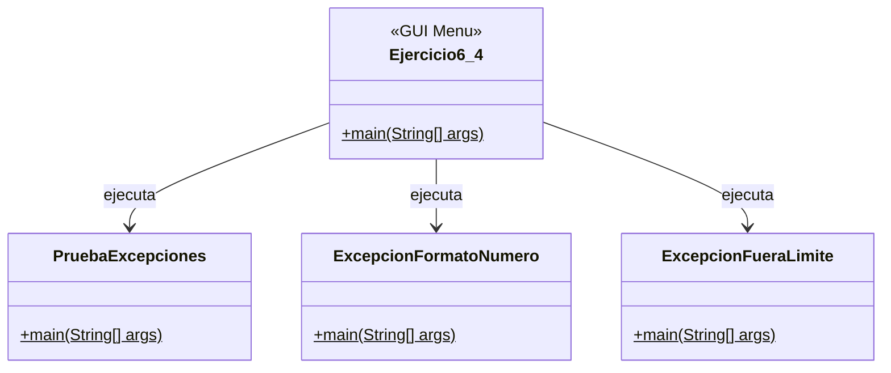
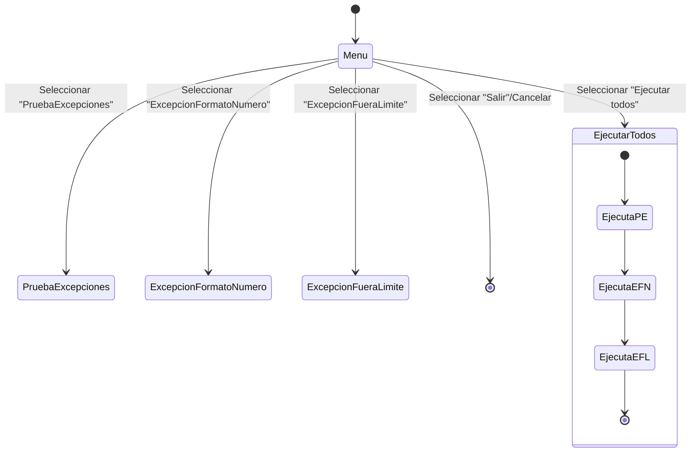

# Documentación - Ejercicio 6.4: Excepciones

## Descripción General

Este ejercicio ilustra el manejo de excepciones en Java mediante los bloques `try`, `catch` y `finally`. Se muestran dos escenarios donde se generan excepciones y se capturan en el orden correcto, resaltando el comportamiento del bloque `finally` que siempre se ejecuta.

Adicionalmente, el flujo principal (`unal.ejercicio6_4.Ejercicio6_4`) ahora ofrece un menú gráfico (Swing) que permite ejecutar: `PruebaExcepciones`, `ExcepcionFormatoNumero` y `ExcepcionFueraLimite` de forma individual o todos en secuencia.

## Objetivos de Aprendizaje

- Identificar bloques de código donde se pueden generar excepciones.
- Identificar los `catch` que capturan una excepción específica.
- Diferenciar los propósitos de `try`, `catch` y `finally`.

## Casos de Uso

### CU1: Manejo de división por cero
- **Actor**: Programa
- **Flujo**:
  1. Ejecutar primer `try`.
  2. Ocurre `ArithmeticException` por `10000/0`.
  3. Se captura y muestra "División por cero".
  4. Se ejecuta el `finally` asociado.

### CU2: Manejo de excepción general por referencia nula
- **Actor**: Programa
- **Flujo**:
  1. Ejecutar segundo `try`.
  2. Se invoca `toString()` sobre `null` y ocurre `NullPointerException`.
  3. No coincide con el primer `catch (ArithmeticException)`; cae en `catch (Exception)`.
  4. Se imprime "Ocurrió una excepción" y luego el `finally` asociado.

## Diagramas de Clase



## Diagrama de Máquina de Estados (flujo principal)



## Ejecución esperada

```
Ingresando al primer try
División por cero
Ingresando al primer finally
Ingresando al segundo try
Ocurrió una excepción
Ingresando al segundo finally
```

## Ejercicios Propuestos Resueltos

### EP1: ExcepciónFueraLímite
- Resultado esperado: imprime `Indice de string por fuera del límite`.
- Implementado en `unal.ejercicio6_4.ExcepcionFueraLimite`.

### EP2: ExcepciónFormatoNúmero
- Resultado esperado: imprime `Excepción de formato de número` y luego `Ingresando al finally`.
- Implementado en `unal.ejercicio6_4.ExcepcionFormatoNumero`.

## Cómo compilar y ejecutar

```bash
mvn clean compile
mvn -q exec:java -Dexec.mainClass="unal.ejercicio6_4.Ejercicio6_4"
```

Para ejecutar los ejercicios propuestos individualmente:

```bash
mvn -q exec:java -Dexec.mainClass="unal.ejercicio6_4.ExcepcionFueraLimite"
mvn -q exec:java -Dexec.mainClass="unal.ejercicio6_4.ExcepcionFormatoNumero"
```
