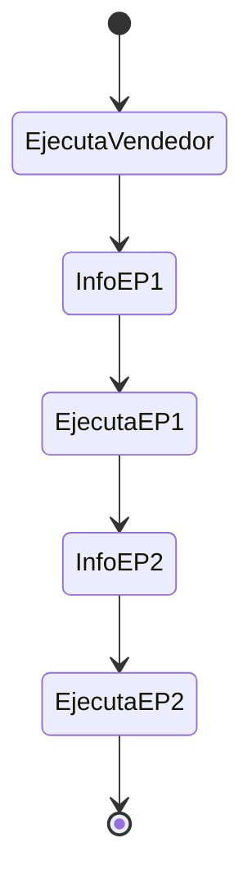
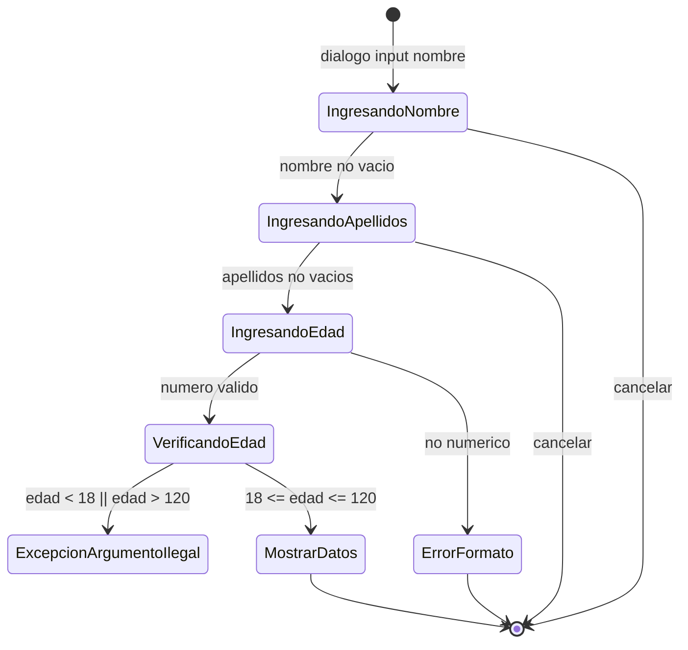

# Documentación - Ejercicio 6.5: Lanzamiento de Excepciones

## Descripción General

Este ejercicio implementa una clase `Vendedor` que demuestra el uso de la sentencia `throw` para lanzar excepciones de forma explícita. La clase valida que la edad del vendedor cumpla con los requisitos establecidos (mayor de 18 años y entre 0-120 años), lanzando `IllegalArgumentException` cuando no se cumplen estas condiciones. La interacción ahora es por interfaz gráfica usando `JOptionPane` (entradas y mensajes), sin consola.

El flujo principal está orquestado por `unal.ejercicio6_5.Ejercicio6_5.main`, que ejecuta secuencialmente: 1) el enunciado (`Vendedor`), 2) EP1 (`ConstructorConExcepcion`) en demostración normal, y 3) EP2 (`TablaASCII`) con consultas válidas y visualización de la tabla. Se muestran diálogos informativos entre etapas. Las pruebas automáticas de errores quedan dentro de cada clase, pero no se ejecutan en el flujo principal para evitar múltiples diálogos de error consecutivos.

## Objetivos de Aprendizaje

- Lanzar excepciones específicas en métodos de una clase
- Conocer y aplicar la sentencia `throw` para el lanzamiento de excepciones
- Implementar validación de datos con manejo de excepciones apropiado

## Casos de Uso

### CU1: Crear Vendedor con Datos Válidos
**Actor:** Usuario
**Descripción:** El usuario desea crear un vendedor con datos válidos.

**Flujo Principal:**
1. El usuario ingresa nombre del vendedor
2. El usuario ingresa apellidos del vendedor
3. El usuario ingresa edad del vendedor (entre 18 y 120 años)
4. El sistema valida la edad
5. El sistema crea el objeto vendedor
6. El sistema muestra los datos del vendedor

### CU2: Validar Edad del Vendedor
**Actor:** Sistema
**Descripción:** El sistema debe validar que la edad del vendedor cumpla los requisitos.

**Flujo Principal:**
1. El sistema recibe la edad del vendedor
2. El sistema verifica si la edad es mayor a 18 años
3. El sistema verifica si la edad está entre 0 y 120 años
4. Si ambas condiciones se cumplen, se asigna la edad al vendedor

**Flujos Alternativos:**
- 2a. Si la edad es menor a 18, se lanza `IllegalArgumentException` con mensaje "El vendedor debe ser mayor de 18 años"
- 3a. Si la edad es negativa o mayor a 120, se lanza `IllegalArgumentException` con mensaje "La edad no puede ser negativa ni mayor a 120"

## Diagramas de Clase

### Diagrama de Clases Principal

```mermaid
classDiagram
    class Ejercicio6_5 { +main(String[] args)$ <<Orquestador GUI>> }

    class Vendedor {
        -String nombre
        -String apellidos
        -int edad
        
        +Vendedor(String nombre, String apellidos)
        +imprimir() void
        +verificarEdad(int edad) void
        +main(String[] args)$ void <<GUI/JOptionPane>>
    }

    class ConstructorConExcepcion { +main(String[] args)$ void <<GUI/JOptionPane>> }
    class TablaASCII { +main(String[] args)$ void <<GUI/JOptionPane>> }

    Ejercicio6_5 --> Vendedor : ejecuta
    Ejercicio6_5 --> ConstructorConExcepcion : ejecuta (EP1)
    Ejercicio6_5 --> TablaASCII : ejecuta (EP2)

    Vendedor ..> "JOptionPane" : usa dialogos
    ConstructorConExcepcion ..> "JOptionPane" : usa dialogos
    TablaASCII ..> "JOptionPane" : usa dialogos
```

### Diagrama de Objetos

```mermaid
classDiagram
    class "vendedor: Vendedor" as VendedorObj {
        +nombre: String "Yulian"
        +apellidos: String "Bedoya"
        +edad: int 19
    }
```

## Diagramas de Máquina de Estados

### Flujo principal (orquestación)



### Vendedor (captura GUI)



## Ejecución esperada

**Caso exitoso:**
```
Nombre del vendedor = Juan
Apellidos del vendedor = Garcia
Edad del vendedor = 25
Nombre del vendedor = Juan
Apellidos del vendedor = Garcia
Edad del vendedor = 25
```

**Caso con excepción (edad < 18):**
```
Nombre del vendedor = Pedro
Apellidos del vendedor = Perez
Edad del vendedor = 17
Exception in thread "main" java.lang.IllegalArgumentException: El vendedor debe ser mayor de 18 años.
    at unal.ejercicio6_5.Vendedor.verificarEdad(Vendedor.java:42)
    at unal.ejercicio6_5.Vendedor.main(Vendedor.java:62)
```

## Ejercicios Propuestos Resueltos

### EP1: Constructor que lanza excepción
**Descripción:** Implementar un constructor que lance una excepción y un controlador que la detecte.

**Solución Implementada:**
- **Clase `ConstructorConExcepcion`**: Constructor que valida que el valor sea positivo
- **Validación**: Si el valor es negativo, lanza `IllegalArgumentException`
- **Controlador**: Método `main` con bloque `try-catch` que captura la excepción
- **Resultado**: Demuestra cómo las excepciones del constructor pueden ser manejadas externamente

**Ubicación:** `unal.ejercicio6_5.ConstructorConExcepcion`

### EP2: Tabla ASCII con manejo de excepciones
**Descripción:** Implementar una clase con tabla ASCII que maneje excepciones apropiadas.

**Solución Implementada:**
- **Clase `TablaASCII`**: Implementa métodos `get()` y `set()` con validación completa
- **Excepciones definidas**:
  - Símbolo nulo: `IllegalArgumentException("El simbolo no puede ser nulo")`
  - Símbolo vacío: `IllegalArgumentException("El simbolo no puede estar vacio")`
  - Símbolo inexistente: `IllegalArgumentException("El simbolo 'X' no existe en la tabla ASCII")`
  - Número inválido: `IllegalArgumentException("El numero debe estar entre 0 y 127 (ASCII valido)")`
- **Funcionalidad**: Permite agregar, consultar y mostrar símbolos ASCII con validación robusta

**Ubicación:** `unal.ejercicio6_5.TablaASCII`

## Instrucciones de Compilación y Ejecución

### Requisitos
- Java 17 o superior
- Apache Maven 3.8+

### Compilación
```bash
mvn clean compile
```

### Ejecución del ejercicio principal (flujo secuencial)
```bash
mvn -q exec:java -Dexec.mainClass="unal.ejercicio6_5.Ejercicio6_5"
```

### Ejecución de ejercicios propuestos
```bash
# Ejercicio Propuesto 1: Constructor con excepción
mvn -q exec:java -Dexec.mainClass="unal.ejercicio6_5.ConstructorConExcepcion"

# Ejercicio Propuesto 2: Tabla ASCII
mvn -q exec:java -Dexec.mainClass="unal.ejercicio6_5.TablaASCII"
```

### Desde NetBeans
1. Abrir el proyecto `Ejercicio6_5`
2. Hacer clic derecho en el proyecto
3. Seleccionar "Run Project"

## Estructura del Proyecto

```
Ejercicio6_5/
├── pom.xml
├── DOCUMENTATION.md
├── README.md
└── src/
    └── main/
        └── java/
            └── unal/
                └── ejercicio6_5/
                    ├── Ejercicio6_5.java           # Clase principal
                    ├── Vendedor.java               # Clase del enunciado
                    ├── ConstructorConExcepcion.java # Ejercicio Propuesto 1
                    └── TablaASCII.java            # Ejercicio Propuesto 2
```

## Validaciones Implementadas

### Validación de Edad del Vendedor
- **Edad mínima**: Mayor a 18 años
- **Edad máxima**: Menor o igual a 120 años
- **Rango válido**: 18 < edad ≤ 120

### Validación de Tabla ASCII
- **Símbolos**: No pueden ser nulos o vacíos
- **Números**: Deben estar entre 0 y 127 (rango ASCII válido)
- **Existencia**: Verificación de símbolos existentes antes de consulta

## Mejoras Implementadas

1. **Manejo Robusto de Excepciones**: Validación completa con mensajes descriptivos
2. **Separación de Responsabilidades**: Cada ejercicio propuesto en su propia clase
3. **Documentación Completa**: Javadoc para todos los métodos públicos
4. **Casos de Prueba**: Ejemplos de uso exitoso y manejo de excepciones
5. **Validación de Entrada**: Verificación de parámetros nulos y valores inválidos
6. **Mensajes Informativos**: Excepciones con mensajes claros y específicos
