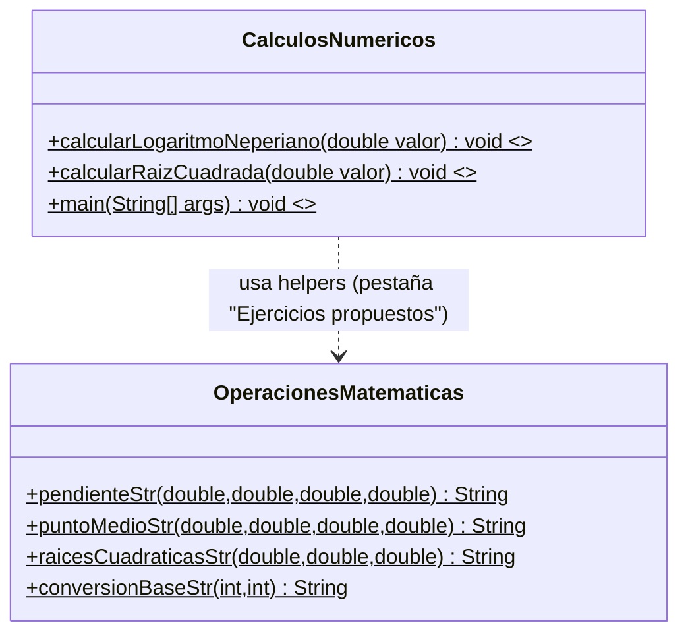
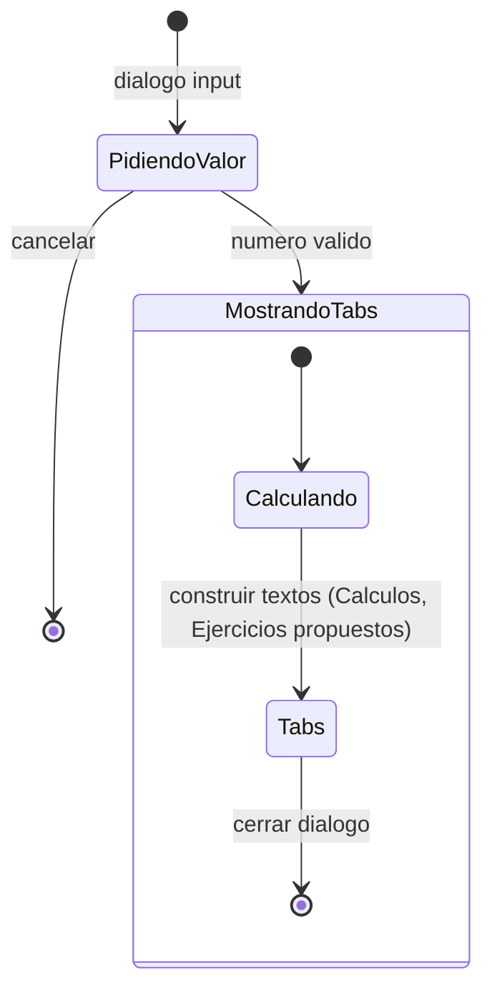
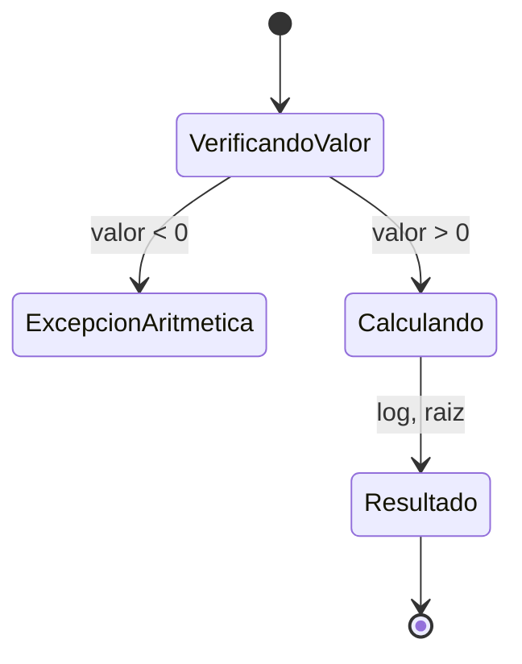

# Documentación - Ejercicio 6.6: Catchs Múltiples

## Descripción General

Este ejercicio implementa una clase `CalculosNumericos` que demuestra el uso de múltiples bloques `catch` para manejar diferentes tipos de excepciones. La clase realiza cálculos matemáticos (logaritmo neperiano y raíz cuadrada) con validación de parámetros y manejo específico de excepciones aritméticas y de entrada. La entrada y los resultados ahora se gestionan con `JOptionPane` (diálogos), sin consola.

Además, la interfaz muestra un único diálogo con pestañas (`JTabbedPane`):
- "Calculos": resultados para logaritmo neperiano y raíz cuadrada del valor ingresado.
- "Ejercicios propuestos": ejemplos consolidados de pendiente, punto medio, raíces cuadráticas y conversión de base (usando `OperacionesMatematicas`).

## Objetivos de Aprendizaje

- Definir múltiples `catch` para el tratamiento de excepciones
- Definir gestores para el tratamiento de excepciones aritméticas
- Implementar validación de parámetros con manejo específico de errores
- Utilizar el operador `|` para manejar múltiples excepciones en un solo catch

## Casos de Uso

### CU1: Calcular Logaritmo Neperiano
**Actor:** Usuario
**Descripción:** El usuario desea calcular el logaritmo neperiano de un valor numérico.

**Flujo Principal:**
1. El usuario ingresa un valor numérico
2. El sistema valida que el valor sea positivo
3. El sistema calcula el logaritmo neperiano usando `Math.log()`
4. El sistema muestra el resultado

**Flujos Alternativos:**
- 2a. Si el valor es negativo, se lanza `ArithmeticException` y se muestra mensaje específico
- 2b. Si el valor no es numérico, se captura `InputMismatchException` y se muestra mensaje específico

### CU2: Calcular Raíz Cuadrada
**Actor:** Usuario
**Descripción:** El usuario desea calcular la raíz cuadrada de un valor numérico.

**Flujo Principal:**
1. El usuario ingresa un valor numérico
2. El sistema valida que el valor sea positivo
3. El sistema calcula la raíz cuadrada usando `Math.sqrt()`
4. El sistema muestra el resultado

**Flujos Alternativos:**
- 2a. Si el valor es negativo, se lanza `ArithmeticException` y se muestra mensaje específico
- 2b. Si el valor no es numérico, se captura `InputMismatchException` y se muestra mensaje específico

## Diagramas de Clase

### Diagrama de Clases Principal



### Diagrama de Objetos

```mermaid
classDiagram
    class "calculos: CalculosNumericos" as CalculosObj {
        +valor: double 25
        +tabs: JTabbedPane
    }
```

## Diagramas de Máquina de Estados (flujo GUI)

### Diálogo con pestañas



### Cálculos (pestaña "Calculos")



## Ejecución esperada

**Caso con valor negativo:**
```
Valor numerico = -200
El valor debe ser un numero positivo para calcular el logaritmo
El valor debe ser un numero positivo para calcular la raiz cuadrada
```

**Caso exitoso:**
```
Valor numerico = 25
Resultados mostrados en la pestaña "Calculos"
```

## Ejercicios Propuestos Resueltos

### EP1: Calcular Pendiente de Recta
**Descripción:** Implementar método para calcular la pendiente entre dos puntos.

**Solución Implementada:**
- **Método `calcularPendiente(double x1, double y1, double x2, double y2)`**
- **Validaciones**:
  - Puntos iguales: `ArithmeticException("Los puntos no pueden ser iguales")`
  - Recta vertical: `ArithmeticException("La pendiente es infinita (recta vertical)")`
- **Catch múltiples**: Maneja `ArithmeticException` e `IllegalArgumentException` por separado

### EP2: Calcular Punto Medio de Recta
**Descripción:** Implementar método para calcular el punto medio entre dos puntos.

**Solución Implementada:**
- **Método `calcularPuntoMedio(double x1, double y1, double x2, double y2)`**
- **Fórmula**: `xMedio = (x1 + x2) / 2`, `yMedio = (y1 + y2) / 2`
- **Manejo de excepciones**: Catch genérico para cualquier error

### EP3: Calcular Raíces de Ecuación Cuadrática
**Descripción:** Implementar método para calcular raíces de ax² + bx + c = 0.

**Solución Implementada:**
- **Método `calcularRaicesCuadraticas(double a, double b, double c)`**
- **Validaciones**:
  - `a = 0`: `IllegalArgumentException("El coeficiente 'a' no puede ser cero")`
  - Discriminante negativo: `ArithmeticException("El discriminante es negativo, no hay raices reales")`
- **Casos**: Una raíz (discriminante = 0) o dos raíces (discriminante > 0)

### EP4: Convertir Número en Base 10 a Base b
**Descripción:** Implementar método para conversión de bases numéricas.

**Solución Implementada:**
- **Método `convertirBase(int numero, int base)`**
- **Validaciones**:
  - Base inválida: `IllegalArgumentException("La base debe estar entre 2 y 36")`
  - Número negativo: `ArithmeticException("El numero debe ser positivo para conversion de base")`
- **Implementación**: Usa `Integer.toString(numero, base)`

### Demostración de Catch Múltiples con Operador |
**Solución Implementada:**
- **Ejemplo**: `catch (ArithmeticException | IllegalArgumentException e)`
- **Ubicación**: Método `main` de `OperacionesMatematicas`
- **Propósito**: Demostrar el uso del operador `|` para manejar múltiples tipos de excepción

**Ubicación:** `unal.ejercicio6_6.OperacionesMatematicas`

## Instrucciones de Compilación y Ejecución

### Requisitos
- Java 17 o superior
- Apache Maven 3.8+

### Compilación
```bash
mvn clean compile
```

### Ejecución del ejercicio principal
```bash
mvn -q exec:java -Dexec.mainClass="unal.ejercicio6_6.Ejercicio6_6"
```

### Ejecución de ejercicios propuestos (opcional, por consola)
```bash
mvn -q exec:java -Dexec.mainClass="unal.ejercicio6_6.OperacionesMatematicas"
```

### Desde NetBeans
1. Abrir el proyecto `Ejercicio6_6`
2. Hacer clic derecho en el proyecto
3. Seleccionar "Run Project"

## Estructura del Proyecto

```
Ejercicio6_6/
├── pom.xml
├── DOCUMENTATION.md
├── README.md
└── src/
    └── main/
        └── java/
            └── unal/
                └── ejercicio6_6/
                    ├── Ejercicio6_6.java           # Clase principal
                    ├── CalculosNumericos.java     # Clase del enunciado (GUI con pestañas)
                    └── OperacionesMatematicas.java # Ejercicios propuestos (helpers y consola)
```

## Validaciones Implementadas

### Validación de Parámetros Matemáticos
- **Valores positivos**: Requeridos para logaritmo y raíz cuadrada
- **Coeficientes válidos**: Para ecuaciones cuadráticas
- **Bases numéricas**: Rango válido de 2 a 36
- **Puntos geométricos**: Validación de puntos iguales y rectas verticales

### Manejo de Excepciones Específicas
- **`ArithmeticException`**: Para errores matemáticos (división por cero, valores negativos)
- **`IllegalArgumentException`**: Para parámetros inválidos
- **`InputMismatchException`**: Para entrada no numérica
- **Catch múltiples**: Manejo específico por tipo de excepción
- **Operador `|`**: Manejo de múltiples excepciones en un solo catch

## Mejoras Implementadas

1. **GUI consolidada con pestañas**: resultados y ejercicios propuestos en una sola ventana.
2. **Manejo Específico de Excepciones**: Cada tipo de error tiene su propio catch con mensaje específico
3. **Validación Robusta**: Verificación completa de parámetros antes de cálculos
4. **Múltiples Operaciones**: Cuatro operaciones matemáticas adicionales implementadas
5. **Demostración de Catch Múltiples**: Ejemplos del operador `|` para manejo eficiente
6. **Mensajes Informativos**: Excepciones con mensajes claros y específicos
7. **Documentación Completa**: Javadoc para todos los métodos públicos
