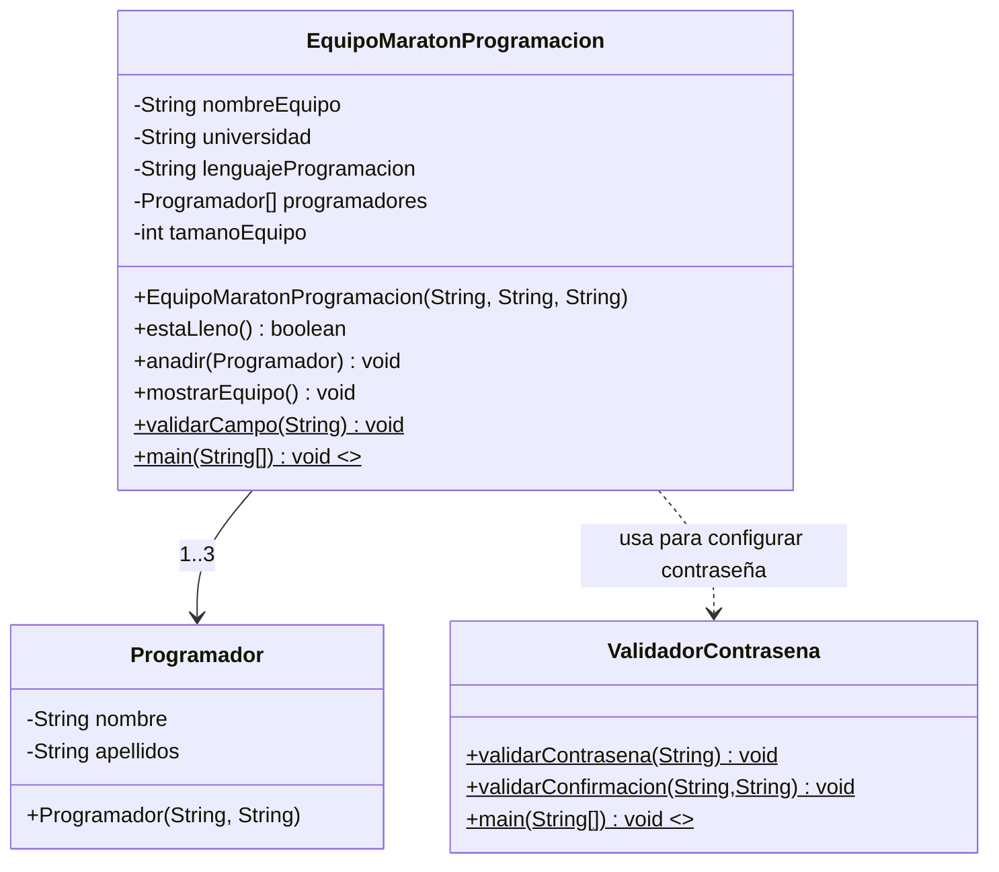
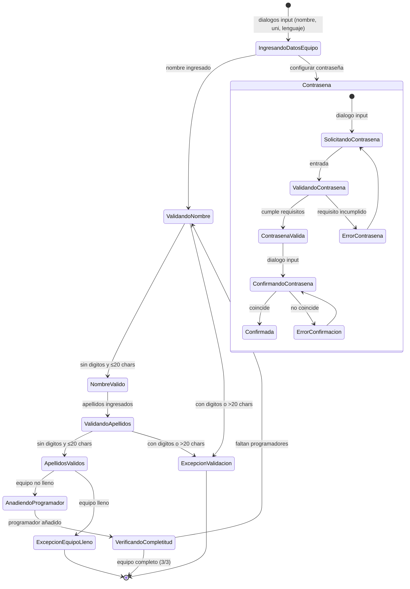

# Documentación - Ejercicio 6.7: Validación de Campos

## Descripción General

Este ejercicio implementa un sistema de validación de campos para un equipo de maratón de programación. La clase `EquipoMaratonProgramacion` gestiona equipos de programadores con validación estricta de nombres y apellidos, asegurando que solo contengan texto y no excedan 20 caracteres. Incluye manejo de excepciones para equipos completos y validación de campos de entrada. La interacción ahora se realiza por `JOptionPane` (diálogos), incluyendo configuración y confirmación de contraseña con la clase `ValidadorContrasena`.

## Objetivos de Aprendizaje

- Definir métodos que realicen validación de campos y generen las excepciones apropiadas
- Implementar restricciones de formato en campos de entrada (alfabético, longitud)
- Manejar excepciones para validación de datos de entrada
- Gestionar límites de capacidad en estructuras de datos

## Casos de Uso

### CU1: Crear Equipo de Maratón
**Actor:** Usuario (Coordinador)
**Descripción:** El usuario desea crear un equipo de maratón de programación.

**Flujo Principal:**
1. El usuario ingresa nombre del equipo
2. El usuario ingresa universidad
3. El usuario ingresa lenguaje de programación
4. El usuario configura la contraseña del equipo y la confirma (validada por `ValidadorContrasena`)
5. El sistema crea el equipo con capacidad para 3 programadores
6. El usuario puede continuar al caso CU2

### CU2: Registrar Programadores
**Actor:** Usuario (Coordinador)
**Descripción:** El usuario desea registrar programadores en el equipo.

**Flujo Principal:**
1. El usuario ingresa nombre del programador
2. El sistema valida que el nombre sea solo texto y ≤ 20 caracteres
3. El usuario ingresa apellidos del programador
4. El sistema valida que los apellidos sean solo texto y ≤ 20 caracteres
5. El sistema añade el programador al equipo
6. Se repite hasta completar 3 programadores

**Flujos Alternativos:**
- 2a. Si el nombre contiene dígitos: `Exception("El nombre no puede tener digitos")`
- 2b. Si el nombre excede 20 caracteres: `Exception("La longitud no debe ser superior a 20 caracteres")`
- 4a. Si los apellidos contienen dígitos: `Exception("El nombre no puede tener digitos")`
- 4b. Si los apellidos exceden 20 caracteres: `Exception("La longitud no debe ser superior a 20 caracteres")`
- 5a. Si el equipo está completo: `Exception("El equipo esta completo. No se pudo agregar programador")`

## Diagramas de Clase

### Diagrama de Clases Principal



### Diagrama de Objetos

```mermaid
classDiagram
    class "equipo: EquipoMaratonProgramacion" as EquipoObj {
        +nombreEquipo: String "EquipoUNAL"
        +universidad: String "Nacional"
        +lenguajeProgramacion: String "Java"
        +tamanoEquipo: int 3
        +programadores: Programador[3]
    }
    
    class "programador1: Programador" as Prog1Obj {
        +nombre: String "Jorge"
        +apellidos: String "Ramirez"
    }
    
    class "programador2: Programador" as Prog2Obj {
        +nombre: String "Pablo"
        +apellidos: String "Perez"
    }
    
    class "programador3: Programador" as Prog3Obj {
        +nombre: String "Jairo"
        +apellidos: String "Mendez"
    }
    
    EquipoObj --> Prog1Obj : 1
    EquipoObj --> Prog2Obj : 1
    EquipoObj --> Prog3Obj : 1
```

## Diagrama de Máquina de Estados (flujo GUI)



## Ejecución esperada

**Caso exitoso:**
```
=== Registro de Equipo de Maraton de Programacion ===
Nombre del equipo = EquipoUNAL
Universidad = Nacional
Lenguaje de programacion = Java

Datos de los integrantes del equipo

--- Integrante 1 ---
Nombre del integrante = Jorge
Apellidos del integrante = Ramirez

--- Integrante 2 ---
Nombre del integrante = Pablo
Apellidos del integrante = Perez

--- Integrante 3 ---
Nombre del integrante = Jairo
Apellidos del integrante = Mendez

=== Informacion del Equipo ===
Nombre del equipo: EquipoUNAL
Universidad: Nacional
Lenguaje de programacion: Java
Tamano del equipo: 3/3

Integrantes:
1. Jorge Ramirez
2. Pablo Perez
3. Jairo Mendez
```

**Caso con excepción:**
```
Nombre del integrante = Pablo3
Exception in thread "main" java.lang.Exception: El nombre no puede tener digitos.
    at unal.ejercicio6_7.EquipoMaratonProgramacion.validarCampo(EquipoMaratonProgramacion.java:80)
    at unal.ejercicio6_7.EquipoMaratonProgramacion.main(EquipoMaratonProgramacion.java:109)
```

## Ejercicios Propuestos Resueltos

### EP1: Validador de Contraseña
**Descripción:** Desarrollar un sistema de validación de contraseñas con requisitos específicos.

**Solución Implementada:**
- **Clase `ValidadorContrasena`**: Sistema completo de validación de contraseñas
- **Requisitos implementados**:
  - Mínimo 8 caracteres: `Exception("La contrasena debe tener minimo 8 caracteres")`
  - Sin espacios en blanco: `Exception("La contrasena no puede tener espacios en blanco")`
  - Al menos una letra minúscula: `Exception("La contrasena debe tener al menos una letra minuscula")`
  - Al menos una letra mayúscula: `Exception("La contrasena debe tener al menos una letra mayuscula")`
  - Al menos un número: `Exception("La contrasena debe tener al menos un numero")`
  - Al menos un carácter especial: `Exception("La contrasena debe tener al menos un caracter especial")`
  - Confirmación de contraseña: `Exception("Las contrasenas no coinciden")`
- **Caracteres especiales**: `!@#$%^&*()_+-=[]{}|;:,.<>?`
- **Funcionalidades**:
  - Validación interactiva con reintentos
  - Demostración de casos de prueba
  - Mensajes de error específicos para cada requisito

**Ubicación:** `unal.ejercicio6_7.ValidadorContrasena`

## Instrucciones de Compilación y Ejecución

### Requisitos
- Java 17 o superior
- Apache Maven 3.8+

### Compilación
```bash
mvn clean compile
```

### Ejecución del ejercicio principal
```bash
mvn -q exec:java -Dexec.mainClass="unal.ejercicio6_7.Ejercicio6_7"
```

### Ejecución de ejercicios propuestos
```bash
# Ejercicio Propuesto: Validador de contraseña
mvn -q exec:java -Dexec.mainClass="unal.ejercicio6_7.ValidadorContrasena"
```

### Desde NetBeans
1. Abrir el proyecto `Ejercicio6_7`
2. Hacer clic derecho en el proyecto
3. Seleccionar "Run Project"

## Estructura del Proyecto

```
Ejercicio6_7/
├── pom.xml
├── DOCUMENTATION.md
├── README.md
└── src/
    └── main/
        └── java/
            └── unal/
                └── ejercicio6_7/
                    ├── Ejercicio6_7.java           # Clase principal
                    ├── EquipoMaratonProgramacion.java # Clase del enunciado
                    ├── Programador.java            # Clase Programador
                    └── ValidadorContrasena.java   # Ejercicio Propuesto
```

## Validaciones Implementadas

### Validación de Campos de Texto
- **Solo caracteres alfabéticos**: Verificación con `Character.isDigit()`
- **Longitud máxima**: Máximo 20 caracteres
- **Campos aplicables**: Nombres y apellidos de programadores

### Validación de Capacidad del Equipo
- **Límite máximo**: 3 programadores por equipo
- **Verificación**: Método `estaLleno()` antes de añadir
- **Excepción**: `Exception("El equipo esta completo. No se pudo agregar programador")`

### Validación de Contraseñas (Ejercicio Propuesto)
- **Longitud mínima**: 8 caracteres
- **Sin espacios**: Verificación de espacios en blanco
- **Complejidad**: Minúsculas, mayúsculas, números, caracteres especiales
- **Confirmación**: Verificación de coincidencia entre contraseñas

## Mejoras Implementadas

1. **Validación Robusta de Campos**: Verificación estricta de formato y longitud
2. **Manejo Específico de Excepciones**: Mensajes descriptivos para cada tipo de error
3. **Gestión de Capacidad**: Control de límites en estructuras de datos
4. **Interfaz Informativa**: Salida clara con información del equipo registrado
5. **Sistema de Contraseñas**: Validación completa con requisitos de seguridad
6. **Casos de Prueba**: Demostración de validaciones exitosas y con errores
7. **Documentación Completa**: Javadoc para todos los métodos públicos
8. **Separación de Responsabilidades**: Clases específicas para diferentes funcionalidades
