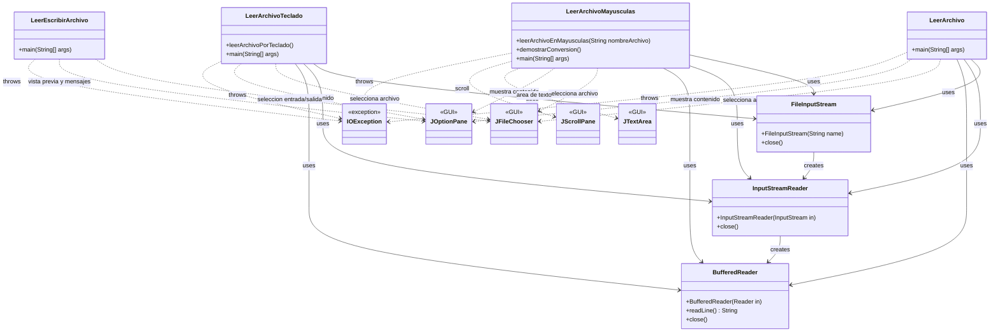
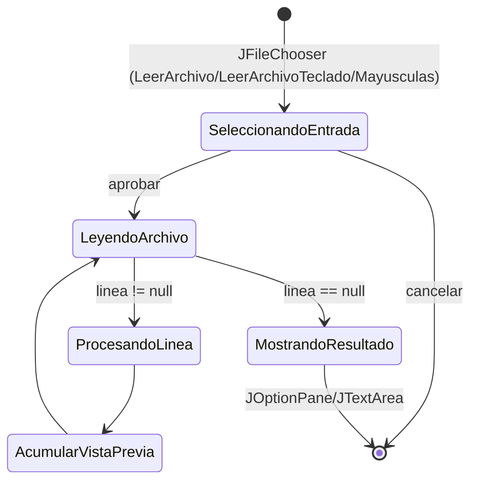

# Ejercicio 6.8 - Lectura de Archivos

## Descripción

Este ejercicio implementa un sistema de lectura y escritura de archivos de texto utilizando las clases `FileInputStream`, `InputStreamReader` y `BufferedReader` de Java. Ahora la interacción es por interfaz gráfica: selección de archivos con `JFileChooser` y visualización con diálogos (`JOptionPane`, `JTextArea`/`JScrollPane`).

## Objetivos de Aprendizaje

Al finalizar este ejercicio, el lector tendrá la capacidad para:

- **Crear un flujo de bytes para leer archivos de texto**
- **Conocer y aplicar las clases InputStreamReader y BufferedReader para la creación del flujo de bytes que facilita la lectura de archivos**
- **Manejar excepciones de entrada/salida (IOException)**
- **Implementar lectura de archivos con entrada por GUI**
- **Realizar transformaciones de texto durante la lectura**

## Casos de Uso

### Caso de Uso 1: Lectura Básica de Archivo
- **Actor**: Usuario del sistema
- **Descripción**: El usuario ejecuta el programa para leer un archivo de texto específico
- **Flujo Principal**:
  1. El programa intenta abrir el archivo "C:/input .txt"
  2. Crea un flujo de bytes usando FileInputStream
  3. Convierte bytes a caracteres usando InputStreamReader
  4. Almacena caracteres en buffer usando BufferedReader
  5. Lee línea por línea el contenido del archivo
  6. Muestra cada línea en pantalla
  7. Cierra el archivo
- **Flujo Alternativo**: Si el archivo no existe o no se puede leer, muestra mensaje de error

### Caso de Uso 2: Lectura con Nombre de Archivo por Teclado
- **Actor**: Usuario del sistema
- **Descripción**: El usuario ingresa el nombre de un archivo por teclado para leerlo
- **Flujo Principal**:
  1. El programa solicita al usuario el nombre del archivo
  2. El usuario ingresa la ruta completa del archivo
  3. El programa intenta abrir y leer el archivo
  4. Muestra el contenido línea por línea con numeración
  5. Cierra el archivo
- **Flujo Alternativo**: Si el archivo no existe, muestra mensaje de error específico

### Caso de Uso 3: Lectura con Conversión a Mayúsculas
- **Actor**: Usuario del sistema
- **Descripción**: El usuario lee un archivo y ve su contenido convertido a mayúsculas
- **Flujo Principal**:
  1. El programa abre el archivo especificado
  2. Lee cada línea del archivo
  3. Convierte cada línea a mayúsculas usando toUpperCase()
  4. Muestra el contenido convertido en pantalla
  5. Cierra el archivo
- **Flujo Alternativo**: Si hay errores de lectura, muestra mensaje de error

## Diagramas

### Diagrama de Clases



### Diagrama de Máquina de Estados (flujos GUI)



## Salida Esperada

### Programa Principal (LeerArchivo)
```
Linea 1
Linea 2
Linea 3
Linea 4
Linea 5
Linea 6
Linea 7
Linea 8
Linea 9
Linea 10
```

### Ejercicio Propuesto 1 (LeerArchivoTeclado)
```
=== Lectura de Archivo por Teclado ===
Ingrese el nombre del archivo (con ruta completa): C:/prueba.txt

--- Contenido del archivo 'C:/prueba.txt' ---
Linea 1: Linea 1
Linea 2: Linea 2
Linea 3: Linea 3
--- Fin del archivo ---
```

### Ejercicio Propuesto 2 (LeerArchivoMayusculas)
```
=== Contenido del archivo en MAYUSCULAS ===
Archivo: C:/prueba.txt
--- Contenido convertido ---
Linea 1: LINEA 1
Linea 2: LINEA 2
Linea 3: LINEA 3
--- Fin del archivo ---
```

## Solución de Ejercicios Propuestos

### Ejercicio Propuesto 1: Lectura con Nombre por Teclado
**Ubicación**: `LeerArchivoTeclado.java`

Este ejercicio se resuelve en la clase `LeerArchivoTeclado` que implementa:
- Solicitud del nombre del archivo por teclado usando `Scanner`
- Manejo de excepciones `FileNotFoundException` e `IOException`
- Numeración de líneas para mejor visualización
- Cierre adecuado de recursos en el bloque `finally`

### Ejercicio Propuesto 2: Conversión a Mayúsculas
**Ubicación**: `LeerArchivoMayusculas.java`

Este ejercicio se resuelve en la clase `LeerArchivoMayusculas` que implementa:
- Método `leerArchivoEnMayusculas()` que convierte el contenido a mayúsculas
- Uso del método `toUpperCase()` de la clase `String`
- Demostración con texto de ejemplo
- Manejo robusto de excepciones

## Conceptos Técnicos Implementados

1. **FileInputStream**: Flujo de entrada para leer bytes de un archivo
2. **InputStreamReader**: Convierte bytes a caracteres Unicode
3. **BufferedReader**: Almacena caracteres en buffer para lectura eficiente
4. **Manejo de Excepciones**: IOException, FileNotFoundException
5. **Cierre de Recursos**: Uso de bloques finally para liberar recursos
6. **Transformación de Texto**: Conversión a mayúsculas usando métodos de String

## Instrucciones de Ejecución

1. **Compilar el proyecto**:
   ```bash
   mvn compile
   ```

2. **Ejecutar el programa principal**:
   ```bash
   mvn exec:java -Dexec.mainClass="unal.ejercicio6_8.Ejercicio6_8"
   ```

3. **Ejecutar ejercicios propuestos**:
   ```bash
   mvn exec:java -Dexec.mainClass="unal.ejercicio6_8.LeerArchivoTeclado"
   mvn exec:java -Dexec.mainClass="unal.ejercicio6_8.LeerArchivoMayusculas"
   ```

## Notas Importantes

- El archivo "C:/prueba.txt" debe existir para que el programa principal funcione correctamente
- Los ejercicios propuestos incluyen manejo de errores para archivos inexistentes
- Se recomienda crear un archivo de prueba con contenido de texto para las demostraciones
- El programa utiliza el patrón de cierre de recursos en bloques `finally` para evitar memory leaks
