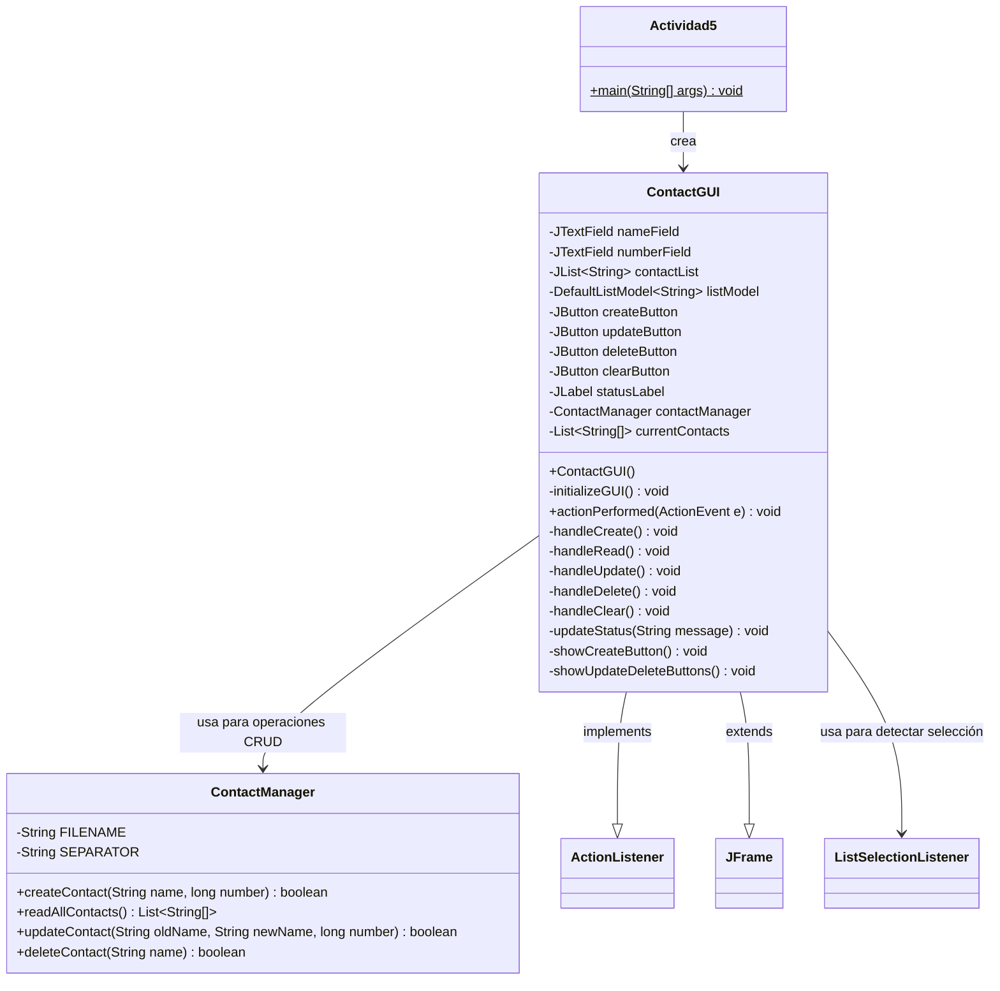

# Documentación - Actividad 5: Aplicación de Interfaz Gráfica con CRUD

## Descripción General

Este ejercicio implementa una aplicación de escritorio con interfaz gráfica de usuario (GUI) utilizando componentes Swing de Java. La aplicación permite gestionar contactos de amigos mediante operaciones CRUD (Create, Read, Update, Delete) utilizando manejo de archivos con `RandomAccessFile`. Los contactos se almacenan en un archivo de texto llamado `friendsContact.txt` con el formato `Nombre!Número`.

## Objetivos de Aprendizaje

Al finalizar este ejercicio, el estudiante tendrá la capacidad para:

- Implementar operaciones CRUD (Create, Read, Update, Delete) en aplicaciones Java
- Utilizar `RandomAccessFile` para el manejo de archivos de texto
- Desarrollar interfaces gráficas de usuario con componentes Swing
- Gestionar eventos de usuario mediante `ActionListener`
- Validar datos de entrada y manejar excepciones en aplicaciones GUI
- Implementar separación de responsabilidades entre lógica de negocio e interfaz de usuario

## Casos de Uso

### CU1: Crear un Nuevo Contacto
**Actor:** Usuario
**Descripción:** El usuario desea agregar un nuevo contacto a su lista de amigos.

**Flujo Principal:**
1. El usuario inicia la aplicación
2. El sistema muestra la ventana principal con campos de entrada y botones CRUD
3. El usuario ingresa el nombre del contacto en el campo "Nombre"
4. El usuario ingresa el número de teléfono en el campo "Número"
5. El usuario presiona el botón "Create"
6. El sistema valida que ambos campos estén completos
7. El sistema verifica que el contacto no exista (por nombre o número)
8. El sistema agrega el contacto al archivo `friendsContact.txt`
9. El sistema muestra un mensaje de confirmación
10. El sistema actualiza automáticamente la lista de contactos

**Flujos Alternativos:**
- 6a. Si algún campo está vacío, el sistema muestra un mensaje de advertencia
- 7a. Si el contacto ya existe, el sistema muestra un mensaje de error indicando que el nombre o número ya está registrado
- 8a. Si ocurre un error de E/S, el sistema muestra un mensaje de error
- 4a. Si el número no es válido (no es numérico), el sistema muestra un mensaje de error de formato

### CU2: Leer y Visualizar Contactos
**Actor:** Usuario
**Descripción:** El usuario desea ver todos los contactos almacenados en el archivo.

**Flujo Principal:**
1. El usuario inicia la aplicación
2. El sistema lee automáticamente todos los contactos del archivo `friendsContact.txt`
3. El sistema muestra la lista de contactos en una lista seleccionable (JList)
4. El usuario puede ver todos los contactos con formato "Nombre - Número"
5. El usuario puede hacer clic en cualquier contacto para seleccionarlo
6. Al seleccionar un contacto, los campos de nombre y número se llenan automáticamente
7. La lista se actualiza automáticamente después de cada operación CRUD

**Flujos Alternativos:**
- 3a. Si no hay contactos en el archivo, el sistema muestra el mensaje "No hay contactos registrados"
- 2a. Si el archivo no existe, el sistema muestra una lista vacía
- 2b. Si ocurre un error de lectura, el sistema muestra un mensaje de error

### CU3: Actualizar un Contacto Existente
**Actor:** Usuario
**Descripción:** El usuario desea modificar la información de un contacto existente.

**Flujo Principal:**
1. El usuario selecciona un contacto de la lista haciendo clic en él
2. El sistema llena automáticamente los campos "Nombre" y "Número" con los datos del contacto seleccionado
3. El sistema oculta el botón "Create" y muestra los botones "Update" y "Delete"
4. El usuario modifica el número (y opcionalmente el nombre) en los campos
5. El usuario presiona el botón "Update"
6. El sistema valida que el nombre esté presente y el número sea válido
7. El sistema solicita el nuevo nombre (o permite mantener el mismo)
8. El sistema busca el contacto en el archivo
9. El sistema actualiza la información del contacto
10. El sistema muestra un mensaje de confirmación
11. El sistema actualiza automáticamente la lista de contactos
12. El sistema limpia la selección y muestra nuevamente solo el botón "Create"

**Flujos Alternativos:**
- 1a. El usuario también puede ingresar manualmente el nombre del contacto a actualizar
- 6a. Si el nombre está vacío, el sistema muestra un mensaje de advertencia
- 6b. Si el número no es válido, el sistema muestra un mensaje de error de formato
- 8a. Si el contacto no se encuentra, el sistema muestra un mensaje de error
- 7a. Si el usuario cancela la entrada del nuevo nombre, la operación se cancela

### CU4: Eliminar un Contacto
**Actor:** Usuario
**Descripción:** El usuario desea eliminar un contacto de su lista.

**Flujo Principal:**
1. El usuario selecciona un contacto de la lista haciendo clic en él
2. El sistema llena automáticamente los campos "Nombre" y "Número" con los datos del contacto seleccionado
3. El sistema oculta el botón "Create" y muestra los botones "Update" y "Delete"
4. El usuario presiona el botón "Delete"
5. El sistema valida que haya un nombre (del campo o de la selección)
6. El sistema solicita confirmación al usuario mediante un diálogo
7. El usuario confirma la eliminación
8. El sistema busca el contacto en el archivo
9. El sistema elimina el contacto del archivo
10. El sistema muestra un mensaje de confirmación
11. El sistema actualiza automáticamente la lista de contactos
12. El sistema limpia la selección y muestra nuevamente solo el botón "Create"

**Flujos Alternativos:**
- 1a. El usuario también puede ingresar manualmente el nombre del contacto a eliminar
- 5a. Si no hay nombre en el campo ni selección, el sistema muestra un mensaje de advertencia
- 7a. Si el usuario cancela la confirmación, la operación se cancela
- 8a. Si el contacto no se encuentra, el sistema muestra un mensaje de error
- 9a. Si ocurre un error al eliminar, el sistema muestra un mensaje de error

### CU5: Limpiar Campos y Selección
**Actor:** Usuario
**Descripción:** El usuario desea limpiar los campos de entrada y la selección actual.

**Flujo Principal:**
1. El usuario presiona el botón "Limpiar"
2. El sistema borra el contenido del campo "Nombre"
3. El sistema borra el contenido del campo "Número"
4. El sistema limpia la selección de la lista de contactos
5. El sistema oculta los botones "Update" y "Delete" y muestra el botón "Create"
6. La ventana queda lista para crear nuevos contactos

## Diagramas de Clase

### Diagrama de Clases Principal



### Diagrama de Objetos

```mermaid
classDiagram
    class "gui: ContactGUI" as GUIObj {
        +nameField: JTextField
        +numberField: JTextField
        +contactList: JList~String~
        +createButton: JButton "Create"
        +updateButton: JButton "Update"
        +deleteButton: JButton "Delete"
        +clearButton: JButton "Limpiar"
        +statusLabel: JLabel
    }
    
    class "contactManager: ContactManager" as ManagerObj {
        +FILENAME: String "friendsContact.txt"
        +SEPARATOR: String "!"
    }
    
    GUIObj --> ManagerObj : 1..1
```

## Componentes Swing Utilizados

| Componente | Propósito | Ubicación en la Ventana |
|------------|-----------|-------------------------|
| `JFrame` | Ventana principal de la aplicación | Contenedor principal |
| `JPanel` | Panel contenedor principal | Panel principal con borde |
| `Container` | Contenedor de componentes gráficos | ContentPane del JFrame |
| `JLabel` | Etiquetas de texto estático | Etiquetas "Nombre:", "Número:", "Lista de Contactos", estado |
| `JTextField` | Campos de entrada de texto | Campos para nombre y número |
| `JList` | Lista seleccionable de elementos | Lista de contactos con formato "Nombre - Número" |
| `DefaultListModel` | Modelo de datos para JList | Almacena los contactos para la lista |
| `JScrollPane` | Panel con barras de desplazamiento | Contenedor de la lista de contactos |
| `JButton` | Botones interactivos | Botones Create, Update, Delete y Limpiar |
| `JOptionPane` | Diálogos de mensaje | Mensajes de confirmación, error y advertencia |
| `GridLayout` | Administrador de diseño | Layout del panel de entrada |
| `FlowLayout` | Administrador de diseño | Layout del panel de botones |
| `BorderLayout` | Administrador de diseño | Layout principal de la ventana |
| `ListSelectionListener` | Listener para eventos de selección | Detecta cambios en la selección de la lista |
| `EmptyBorder` | Borde vacío para espaciado | Bordes de los paneles |

## Operaciones CRUD Implementadas

### Create (Crear)
- **Método:** `ContactManager.createContact(String name, long number)`
- **Funcionalidad:** Agrega un nuevo contacto al archivo si no existe
- **Validación:** Verifica que no exista un contacto con el mismo nombre o número
- **Formato de almacenamiento:** `Nombre!Número`

### Read (Leer)
- **Método:** `ContactManager.readAllContacts()`
- **Funcionalidad:** Lee todos los contactos del archivo y los retorna como lista
- **Manejo de archivo vacío:** Retorna lista vacía si el archivo no existe o está vacío
- **Automatización:** La lectura se ejecuta automáticamente al iniciar la aplicación y después de cada operación CRUD
- **Visualización:** Los contactos se muestran en una lista seleccionable (JList) con formato "Nombre - Número"

### Update (Actualizar)
- **Método:** `ContactManager.updateContact(String oldName, String newName, long newNumber)`
- **Funcionalidad:** Actualiza un contacto existente usando un archivo temporal
- **Proceso:** 
  1. Lee el archivo original
  2. Crea un archivo temporal con los cambios
  3. Copia el contenido temporal al archivo original
  4. Elimina el archivo temporal

### Delete (Eliminar)
- **Método:** `ContactManager.deleteContact(String name)`
- **Funcionalidad:** Elimina un contacto del archivo usando un archivo temporal
- **Proceso:** Similar al Update, pero omite el contacto a eliminar

## Métodos de Validación y Manejo de Errores

### Validación de Entrada
- **Campos obligatorios:** Nombre y número para Create; nombre y número para Update
- **Formato numérico:** El número debe ser un valor `long` válido
- **Verificación de duplicados:** No se permiten contactos con el mismo nombre o número
- **Confirmación de eliminación:** Se solicita confirmación antes de eliminar
- **Selección de contactos:** Los contactos pueden seleccionarse desde la lista o ingresarse manualmente

### Mensajes de Error y Confirmación
- **Campo vacío:** "Debe ingresar nombre y número." / "Debe ingresar el nombre del contacto a eliminar."
- **Contacto duplicado:** "El contacto ya existe (nombre o número duplicado)."
- **Contacto no encontrado:** "No se encontró el contacto con ese nombre."
- **Error de formato:** "El número debe ser un valor numérico válido."
- **Error de E/S:** "Error de E/S: [descripción del error]"
- **Éxito:** Mensajes de confirmación para cada operación exitosa

### Manejo de Excepciones
- **IOException:** Capturada y mostrada al usuario mediante `JOptionPane`
- **NumberFormatException:** Capturada y mostrada con mensaje específico
- **Exception genérica:** Capturada para errores inesperados

## Características de UX/UI

### Interfaz Dinámica
- **Botones Contextuales:** Los botones se muestran u ocultan según el estado de la aplicación:
  - Sin selección: Solo se muestra el botón "Create"
  - Con selección: Se muestran los botones "Update" y "Delete", se oculta "Create"
- **Selección de Contactos:** Los contactos se pueden seleccionar haciendo clic en la lista
- **Auto-rellenado:** Al seleccionar un contacto, los campos de nombre y número se llenan automáticamente

### Tooltips
Todos los componentes interactivos tienen tooltips informativos:
- **Create:** "Crear un nuevo contacto"
- **Update:** "Actualizar el contacto seleccionado"
- **Delete:** "Eliminar el contacto seleccionado"
- **Limpiar:** "Limpiar los campos de entrada"
- **Lista de contactos:** "Selecciona un contacto para modificar o eliminar"

### Feedback Visual
- **Etiqueta de Estado:** Muestra el estado actual de la aplicación en la parte inferior
- **Colores de Botones:** 
  - Verde para Create (operación positiva)
  - Azul para Update (operación de modificación)
  - Rojo para Delete (operación destructiva)
  - Gris para Limpiar (operación neutra)
- **Actualización Automática:** La lista se actualiza automáticamente después de cada operación

## Características Técnicas

### Manejo de Archivos
- **Clase utilizada:** `RandomAccessFile`
- **Modo de apertura:** "rw" (lectura y escritura)
- **Separador:** "!" (exclamación) para separar nombre y número
- **Archivo temporal:** Se utiliza `temp.txt` para operaciones de actualización y eliminación
- **Codificación:** UTF-8 (por defecto en Java)

### Arquitectura
- **Separación de responsabilidades:** 
  - `ContactManager`: Lógica de negocio y manejo de archivos
  - `ContactGUI`: Interfaz de usuario y gestión de eventos
  - `Actividad5`: Punto de entrada de la aplicación
- **Patrón de diseño:** Modelo-Vista-Controlador (MVC) simplificado

## Instrucciones de Compilación y Ejecución

### Requisitos
- Java 17 o superior
- Apache Maven 3.8+

### Compilación
```bash
cd Evaluacion5/Actividad5
mvn clean compile
```

### Ejecución
```bash
mvn exec:java
```

### Desde NetBeans
1. Abrir el proyecto `Actividad5`
2. Hacer clic derecho en el proyecto
3. Seleccionar "Run Project"

### Ejecución Directa
```bash
cd Evaluacion5/Actividad5
javac -d target/classes src/main/java/unal/actividad5/*.java
java -cp target/classes unal.actividad5.Actividad5
```

## Estructura del Proyecto

```
Actividad5/
├── pom.xml
├── DOCUMENTATION.md
└── src/
    └── main/
        └── java/
            └── unal/
                └── actividad5/
                    ├── Actividad5.java      # Clase principal
                    ├── ContactGUI.java      # Interfaz gráfica
                    └── ContactManager.java  # Lógica CRUD y manejo de archivos
```

## Archivos Generados

Durante la ejecución de la aplicación, se generan los siguientes archivos:

- `friendsContact.txt`: Archivo principal que almacena los contactos
- `temp.txt`: Archivo temporal utilizado durante operaciones de actualización y eliminación (se elimina automáticamente)

## Ejemplos de Uso

### Crear un Contacto
1. Ingresar nombre: "Juan Pérez"
2. Ingresar número: "3001234567"
3. Presionar "Create"
4. Ver mensaje de confirmación y actualización de la lista

### Leer Contactos
1. La lista de contactos se carga automáticamente al iniciar la aplicación
2. Ver todos los contactos en la lista seleccionable
3. Hacer clic en un contacto para seleccionarlo y llenar los campos automáticamente

### Actualizar un Contacto
1. Seleccionar un contacto de la lista haciendo clic en él (o ingresar el nombre manualmente)
2. Los campos se llenan automáticamente con los datos del contacto
3. Aparecen los botones "Update" y "Delete" (el botón "Create" se oculta)
4. Modificar el número (y opcionalmente el nombre) en los campos
5. Presionar "Update"
6. Ingresar nuevo nombre (o dejar vacío para mantener el mismo)
7. Ver mensaje de confirmación
8. La lista se actualiza automáticamente

### Eliminar un Contacto
1. Seleccionar un contacto de la lista haciendo clic en él (o ingresar el nombre manualmente)
2. Los campos se llenan automáticamente con los datos del contacto
3. Aparecen los botones "Update" y "Delete" (el botón "Create" se oculta)
4. Presionar "Delete"
5. Confirmar la eliminación en el diálogo
6. Ver mensaje de confirmación
7. La lista se actualiza automáticamente

## Mejoras Implementadas

1. **Interfaz Gráfica Completa:** Implementación de GUI con todos los componentes necesarios
2. **Lista Seleccionable:** Uso de JList en lugar de JTextArea para mejor interacción con los contactos
3. **Botones Dinámicos:** Los botones se muestran/ocultan según el contexto (Create cuando no hay selección, Update/Delete cuando hay selección)
4. **Lectura Automática:** La lista de contactos se carga automáticamente al iniciar y se actualiza después de cada operación
5. **Selección Intuitiva:** Al hacer clic en un contacto, los campos se llenan automáticamente
6. **Tooltips Informativos:** Todos los botones y la lista tienen tooltips que explican su función
7. **Etiqueta de Estado:** Barra de estado en la parte inferior que muestra el estado actual de la aplicación
8. **Validación Robusta:** Validación de entrada de datos en todos los campos
9. **Manejo de Excepciones:** Captura y manejo apropiado de todas las excepciones posibles
10. **Separación de Responsabilidades:** Arquitectura clara separando lógica de negocio e interfaz
11. **Mensajes Informativos:** Mensajes claros para el usuario en todas las operaciones
12. **Actualización Automática:** La lista de contactos se actualiza automáticamente después de cada operación
13. **Confirmación de Eliminación:** Protección contra eliminaciones accidentales
14. **Manejo de Archivos Temporal:** Uso correcto de archivos temporales para operaciones de actualización y eliminación
15. **Diseño Visual Mejorado:** Botones con colores distintivos (verde para Create, azul para Update, rojo para Delete, gris para Limpiar)
16. **Mejor UX:** La interfaz guía al usuario mostrando solo las opciones relevantes en cada momento

