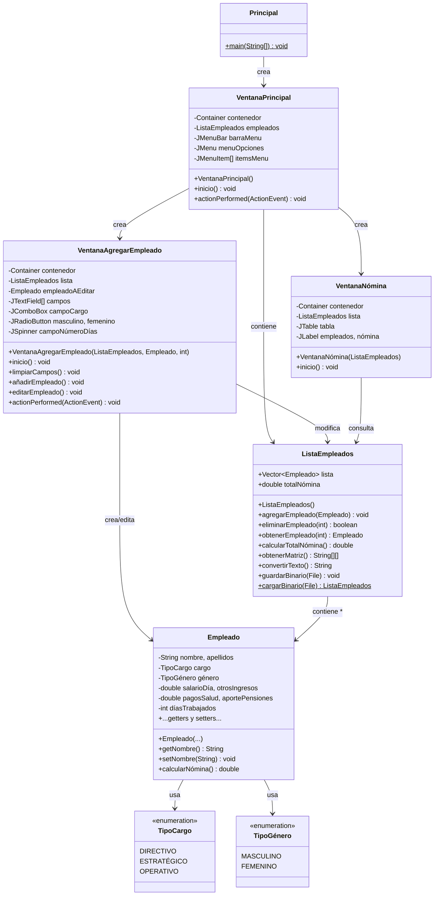
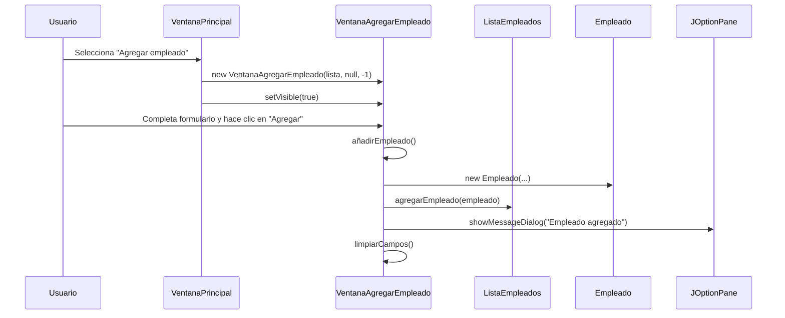
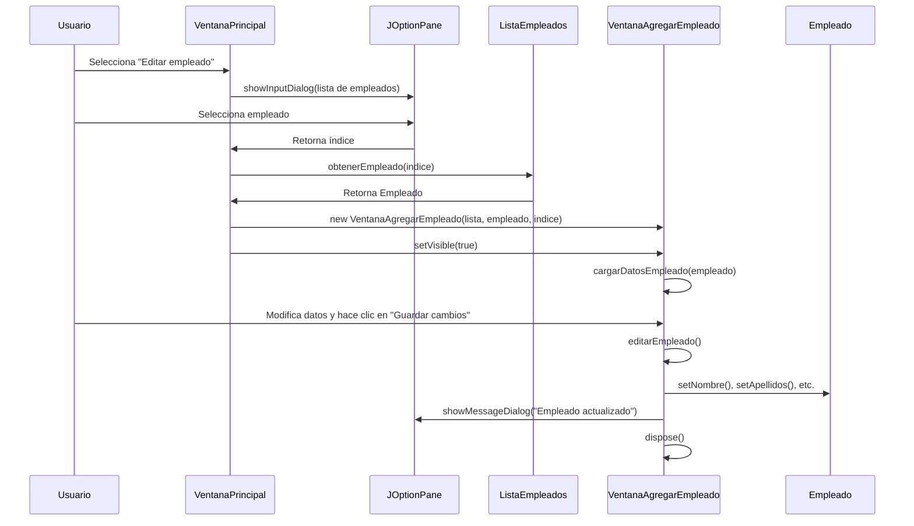
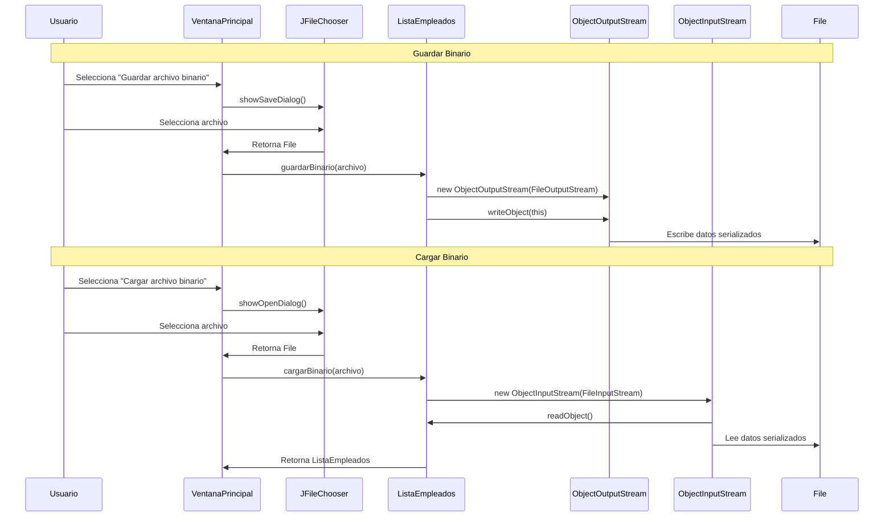

# Documentación - Ejercicio 8.4: Cuadros de Diálogo - Sistema de Nómina

## Descripción General

Este ejercicio implementa un sistema completo de gestión de nómina de empleados utilizando una interfaz gráfica de usuario (Swing) con cuadros de diálogo modales. El programa permite agregar, editar, eliminar y consultar empleados, calcular nóminas y guardar/cargar datos en formato texto y binario.

El sistema utiliza `JOptionPane` para crear cuadros de diálogo modales que facilitan la interacción con el usuario, y `JFileChooser` para la selección de archivos y directorios.

## Objetivos de Aprendizaje

- Implementar cuadros de diálogo modales utilizando `JOptionPane`
- Crear interfaces gráficas de usuario con Swing
- Gestionar eventos de acción en componentes gráficos
- Implementar persistencia de datos en archivos de texto y binarios
- Aplicar el patrón MVC (Modelo-Vista-Controlador) en aplicaciones Swing

## Casos de Uso

### CU1: Agregar Empleado
**Actor:** Usuario (Administrador)
**Descripción:** El usuario desea agregar un nuevo empleado al sistema.

**Flujo Principal:**
1. El usuario selecciona "Agregar empleado" del menú
2. Se abre una ventana modal con un formulario
3. El usuario ingresa: nombre, apellidos, cargo, género, salario por día, días trabajados, otros ingresos, pagos por salud, aportes pensiones
4. El usuario hace clic en "Agregar"
5. El sistema valida los datos y agrega el empleado
6. Se muestra un mensaje de confirmación mediante `JOptionPane`

**Flujos Alternativos:**
- 5a. Si hay campos vacíos o formato inválido: se muestra mensaje de error mediante `JOptionPane.ERROR_MESSAGE`

### CU2: Calcular Nómina
**Actor:** Usuario (Administrador)
**Descripción:** El usuario desea ver la nómina calculada de todos los empleados.

**Flujo Principal:**
1. El usuario selecciona "Calcular nómina" del menú
2. Se abre una ventana que muestra una tabla con los empleados
3. Se calcula y muestra el total de la nómina mensual

### CU3: Editar Empleado
**Actor:** Usuario (Administrador)
**Descripción:** El usuario desea modificar los datos de un empleado existente.

**Flujo Principal:**
1. El usuario selecciona "Editar empleado" del menú
2. Se muestra un diálogo con la lista de empleados disponibles
3. El usuario selecciona el empleado a editar
4. Se abre una ventana con el formulario prellenado con los datos del empleado
5. El usuario modifica los campos necesarios
6. El usuario hace clic en "Guardar cambios"
7. El sistema actualiza los datos del empleado
8. Se muestra un mensaje de confirmación

**Flujos Alternativos:**
- 2a. Si no hay empleados: se muestra mensaje informativo
- 7a. Si hay errores de validación: se muestra mensaje de error

### CU4: Eliminar Empleado
**Actor:** Usuario (Administrador)
**Descripción:** El usuario desea eliminar un empleado del sistema.

**Flujo Principal:**
1. El usuario selecciona "Eliminar empleado" del menú
2. Se muestra un diálogo con la lista de empleados disponibles
3. El usuario selecciona el empleado a eliminar
4. Se muestra un diálogo de confirmación (`JOptionPane.YES_NO_OPTION`)
5. Si el usuario confirma, se elimina el empleado
6. Se muestra un mensaje de confirmación

**Flujos Alternativos:**
- 2a. Si no hay empleados: se muestra mensaje informativo
- 5a. Si el usuario cancela: no se realiza ninguna acción

### CU5: Guardar Archivo de Texto
**Actor:** Usuario (Administrador)
**Descripción:** El usuario desea guardar los datos de la nómina en un archivo de texto.

**Flujo Principal:**
1. El usuario selecciona "Guardar archivo" del menú
2. Se abre un `JFileChooser` en modo directorio
3. El usuario selecciona un directorio
4. El sistema crea el archivo "Nómina.txt" en el directorio seleccionado
5. Se muestra un mensaje de confirmación con la ubicación del archivo

### CU6: Guardar Archivo Binario
**Actor:** Usuario (Administrador)
**Descripción:** El usuario desea guardar los datos de la nómina en un archivo binario.

**Flujo Principal:**
1. El usuario selecciona "Guardar archivo binario" del menú
2. Se abre un `JFileChooser` en modo archivo
3. El usuario especifica el nombre y ubicación del archivo
4. El sistema serializa y guarda la lista de empleados
5. Se muestra un mensaje de confirmación

**Flujos Alternativos:**
- 4a. Si hay error de escritura: se muestra mensaje de error

### CU7: Cargar Archivo Binario
**Actor:** Usuario (Administrador)
**Descripción:** El usuario desea cargar datos de nómina desde un archivo binario.

**Flujo Principal:**
1. El usuario selecciona "Cargar archivo binario" del menú
2. Se abre un `JFileChooser` en modo archivo
3. El usuario selecciona el archivo binario
4. Se muestra un diálogo de confirmación para reemplazar los datos actuales
5. Si el usuario confirma, se cargan los datos del archivo
6. Se muestra un mensaje con la cantidad de empleados cargados

**Flujos Alternativos:**
- 5a. Si hay error de lectura: se muestra mensaje de error
- 5b. Si el usuario cancela: no se cargan los datos

## Diagramas de Clase



## Diagrama de Secuencia - Agregar Empleado



## Diagrama de Secuencia - Editar Empleado



## Diagrama de Secuencia - Guardar/Cargar Binario



## Ejercicios Propuestos Resueltos

### EP1: Agregar funcionalidades editar y eliminar empleados

**Implementación:**
- **Editar empleado**: Se agregó el método `editarEmpleado()` en `VentanaAgregarEmpleado` que permite modificar los datos de un empleado existente. La ventana se reutiliza para editar cargando los datos del empleado seleccionado.
- **Eliminar empleado**: Se agregó el método `eliminarEmpleado(int indice)` en `ListaEmpleados` y la opción correspondiente en el menú de `VentanaPrincipal` con confirmación mediante `JOptionPane.showConfirmDialog()`.

**Ubicación:**
- `VentanaPrincipal.actionPerformed()` - Manejo de eventos para editar/eliminar
- `VentanaAgregarEmpleado.editarEmpleado()` - Lógica de edición
- `ListaEmpleados.eliminarEmpleado(int)` - Eliminación de empleados
- `Empleado` - Métodos setter para modificar atributos

### EP2: Guardar y leer datos como archivo binario

**Implementación:**
- **Guardar binario**: Se implementó `guardarBinario(File archivo)` en `ListaEmpleados` que utiliza `ObjectOutputStream` para serializar la lista completa de empleados.
- **Cargar binario**: Se implementó `cargarBinario(File archivo)` como método estático en `ListaEmpleados` que utiliza `ObjectInputStream` para deserializar y cargar los datos.
- Se agregaron las opciones "Guardar archivo binario" y "Cargar archivo binario" en el menú principal.
- Las clases `Empleado` y `ListaEmpleados` implementan `Serializable` para permitir la serialización.

**Ubicación:**
- `ListaEmpleados.guardarBinario(File)` - Guardado binario
- `ListaEmpleados.cargarBinario(File)` - Carga binaria
- `VentanaPrincipal.actionPerformed()` - Manejo de eventos para guardar/cargar binario

## Estructura del Proyecto

```
Ejercicio8_4/
├── pom.xml
├── DOCUMENTATION.md
└── src/
    └── main/
        └── java/
            └── unal/
                └── ejercicio8_4/
                    └── nomina/
                        ├── Principal.java                    # Punto de entrada
                        ├── VentanaPrincipal.java             # Ventana principal con menú
                        ├── VentanaAgregarEmpleado.java      # Formulario agregar/editar
                        ├── VentanaNómina.java               # Tabla de nómina
                        ├── ListaEmpleados.java              # Gestión de empleados
                        ├── Empleado.java                    # Modelo de empleado
                        ├── TipoCargo.java                  # Enum cargo
                        └── TipoGénero.java                 # Enum género
```

## Componentes Swing Utilizados

### Cuadros de Diálogo (JOptionPane)
- **Mensaje de información**: `JOptionPane.showMessageDialog()` con `INFORMATION_MESSAGE`
- **Mensaje de error**: `JOptionPane.showMessageDialog()` con `ERROR_MESSAGE`
- **Diálogo de confirmación**: `JOptionPane.showConfirmDialog()` con `YES_NO_OPTION`
- **Diálogo de selección**: `JOptionPane.showInputDialog()` con lista de opciones

### Selector de Archivos (JFileChooser)
- **Selección de directorio**: `setFileSelectionMode(JFileChooser.DIRECTORIES_ONLY)`
- **Selección de archivo**: `setFileSelectionMode(JFileChooser.FILES_ONLY)`
- **Diálogo de guardar**: `showSaveDialog(Component)`
- **Diálogo de abrir**: `showOpenDialog(Component)`

### Componentes de Formulario
- **JTextField**: Campos de texto para nombre, apellidos, salarios, etc.
- **JComboBox**: Selección de cargo (Directivo, Estratégico, Operativo)
- **JRadioButton + ButtonGroup**: Selección de género (Masculino, Femenino)
- **JSpinner**: Selección de días trabajados (1-31)
- **JTable**: Visualización de empleados y nómina
- **JMenuBar + JMenu + JMenuItem**: Barra de menú principal

## Persistencia de Datos

### Archivo de Texto
- **Formato**: Archivo plano con formato legible
- **Ubicación**: Seleccionada por el usuario mediante `JFileChooser`
- **Nombre**: "Nómina.txt"
- **Contenido**: Datos de cada empleado y total de nómina

### Archivo Binario
- **Formato**: Serialización Java (`.dat`)
- **Método**: `ObjectOutputStream` / `ObjectInputStream`
- **Ventajas**: Preserva tipos de datos, más eficiente, permite cargar estado completo
- **Clases serializables**: `Empleado`, `ListaEmpleados`, `TipoCargo`, `TipoGénero`

## Cálculo de Nómina

La nómina mensual de cada empleado se calcula mediante la fórmula:

```
Salario mensual = (días trabajados × sueldo por día) + otros ingresos - pagos por salud - aporte pensiones
```

El total de la nómina de la empresa es la suma de los salarios mensuales de todos los empleados.

## Instrucciones de Compilación y Ejecución

### Requisitos
- Java 24 o superior
- Apache Maven 3.8+
- NetBeans 12+ (opcional)

### Compilación
```bash
cd Evaluacion6/Ejercicio8_4
mvn clean compile
```

### Ejecución
```bash
mvn exec:java -Dexec.mainClass="unal.ejercicio8_4.nomina.Principal"
```

### Desde NetBeans
1. Abrir NetBeans IDE
2. Seleccionar **File** → **Open Project**
3. Navegar hasta `Evaluacion6/Ejercicio8_4`
4. Seleccionar el proyecto y hacer clic en **Open Project**
5. Hacer clic derecho en el proyecto → **Run Project**

## Validaciones Implementadas

- **Campos numéricos**: Validación mediante `Double.parseDouble()` y `Integer.parseInt()` con manejo de excepciones
- **Campos vacíos**: Verificación antes de procesar datos
- **Confirmaciones**: Diálogos de confirmación para acciones destructivas (eliminar, cargar archivo)
- **Rangos**: Spinner con valores mínimos y máximos (1-31 días)

## Mejoras Implementadas

1. **Reutilización de ventana**: `VentanaAgregarEmpleado` se usa tanto para agregar como para editar
2. **Persistencia binaria**: Guardado y carga de datos en formato binario para preservar tipos
3. **Interfaz intuitiva**: Diálogos modales que guían al usuario en cada acción
4. **Validación robusta**: Manejo de excepciones en todas las operaciones de entrada
5. **Confirmaciones**: Diálogos de confirmación para operaciones críticas
6. **Documentación completa**: Javadoc para todas las clases y métodos públicos


