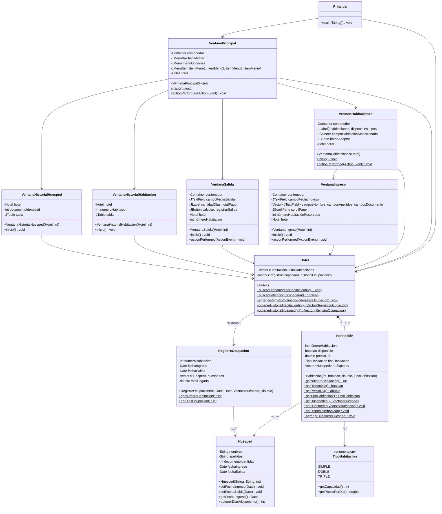

# Documentación - Ejercicio 8.5: Gestión de Contenidos - Sistema de Hotel

## Descripción General

Este ejercicio implementa un sistema completo de gestión de hotel utilizando interfaces gráficas de usuario (Swing) con diferentes tipos de layouts. El sistema permite gestionar el ingreso y salida de huéspedes en un hotel con diez habitaciones de diferentes tipos (simples, dobles y triples), cada una con capacidad y precio distintos.

El programa utiliza layouts como `GridBagLayout`, `BorderLayout`, y posicionamiento absoluto para organizar los componentes gráficos de manera eficiente. Además, implementa un sistema de historial que registra todas las ocupaciones para consultas posteriores.

## Objetivos de Aprendizaje

- Implementar interfaces gráficas de usuario utilizando diferentes layouts de Swing
- Gestionar componentes gráficos con `GridBagLayout`, `BorderLayout` y posicionamiento absoluto
- Implementar sistemas de registro histórico de datos
- Gestionar múltiples entidades relacionadas (hotel, habitaciones, huéspedes)
- Validar datos de entrada en interfaces gráficas
- Manejar eventos de acción en componentes Swing

## Casos de Uso

### CU1: Consultar Habitaciones
**Actor:** Usuario (Recepcionista)
**Descripción:** El usuario desea consultar el estado y tipo de las habitaciones del hotel.

**Flujo Principal:**
1. El usuario selecciona "Consultar habitaciones" del menú principal
2. Se abre la ventana `VentanaHabitaciones`
3. Se muestra un listado de las 10 habitaciones con:
   - Número de habitación
   - Estado (Disponible/No disponible)
   - Tipo (SIMPLE, DOBLE, TRIPLE)
4. El usuario puede seleccionar una habitación mediante un spinner (1-10)
5. El usuario hace clic en "Aceptar"
6. Si la habitación está disponible, se abre `VentanaIngreso`

**Flujos Alternativos:**
- 6a. Si la habitación está ocupada: se muestra mensaje "La habitación está ocupada"

### CU2: Registrar Ingreso de Huéspedes
**Actor:** Usuario (Recepcionista)
**Descripción:** El usuario desea registrar el ingreso de uno o más huéspedes a una habitación.

**Flujo Principal:**
1. Desde `VentanaHabitaciones`, el usuario selecciona una habitación disponible
2. Se abre `VentanaIngreso` mostrando el número de habitación y su tipo
3. El usuario ingresa la fecha de ingreso (formato: aaaa-mm-dd)
4. El sistema muestra campos dinámicos según el tipo de habitación:
   - Simple: 1 conjunto de campos (nombre, apellidos, documento)
   - Doble: 2 conjuntos de campos
   - Triple: 3 conjuntos de campos
5. El usuario completa los datos de todos los huéspedes
6. El usuario hace clic en "Aceptar"
7. El sistema valida que todos los campos estén completos
8. Se crean los objetos `Huésped` y se asocian a la `Habitación`
9. La habitación se marca como no disponible
10. Se muestra mensaje de confirmación "Los huéspedes han sido registrados"

**Flujos Alternativos:**
- 7a. Si hay campos vacíos: se muestra mensaje "Todos los campos son obligatorios"
- 7b. Si el formato de fecha es incorrecto: se muestra mensaje "La fecha no está en el formato solicitado"
- 7c. Si el documento no es numérico: se muestra mensaje "Campo nulo o error en formato de numero"

### CU3: Registrar Salida de Huéspedes
**Actor:** Usuario (Recepcionista)
**Descripción:** El usuario desea registrar la salida de los huéspedes y calcular el pago.

**Flujo Principal:**
1. El usuario selecciona "Salida de huéspedes" del menú principal
2. Se muestra un diálogo solicitando el número de habitación
3. El usuario ingresa el número de habitación (1-10)
4. El sistema valida que la habitación esté ocupada
5. Se abre `VentanaSalida` mostrando:
   - Número de habitación
   - Fecha de ingreso
6. El usuario ingresa la fecha de salida (formato: aaaa-mm-dd)
7. El usuario hace clic en "Calcular"
8. El sistema valida que la fecha de salida sea posterior a la de ingreso
9. Se calcula la cantidad de días de alojamiento
10. Se calcula el total a pagar (días × precio por día)
11. Se muestra la cantidad de días y el total
12. Se habilita el botón "Registrar Salida"
13. El usuario hace clic en "Registrar Salida"
14. Se crea un `RegistroOcupacion` y se agrega al historial
15. La habitación se marca como disponible
16. Se muestra mensaje "Se ha registrado la salida de los huéspedes"

**Flujos Alternativos:**
- 3a. Si el número está fuera del rango: se muestra "El número de habitación debe estar entre 1 y 10"
- 4a. Si la habitación no está ocupada: se muestra "La habitación ingresada no ha sido ocupada"
- 8a. Si la fecha de salida es anterior a la de ingreso: se muestra "La fecha de salida es menor que la de ingreso"
- 8b. Si el formato de fecha es incorrecto: se muestra "La fecha no está en el formato solicitado"

### CU4: Consultar Historial por Habitación
**Actor:** Usuario (Administrador)
**Descripción:** El usuario desea ver el historial completo de ocupaciones de una habitación específica.

**Flujo Principal:**
1. El usuario selecciona "Historial por habitación" del menú principal
2. Se muestra un diálogo solicitando el número de habitación
3. El usuario ingresa el número de habitación (1-10)
4. Se abre `VentanaHistorialHabitacion` mostrando una tabla con:
   - Fecha de ingreso
   - Fecha de salida
   - Cantidad de días
   - Lista de huéspedes (nombres completos)
   - Total pagado
5. Si no hay registros, se muestra mensaje "No hay registros históricos para esta habitación"

**Flujos Alternativos:**
- 3a. Si el número está fuera del rango: se muestra mensaje de error

### CU5: Consultar Historial por Huésped
**Actor:** Usuario (Administrador)
**Descripción:** El usuario desea ver el historial de habitaciones ocupadas por un huésped específico.

**Flujo Principal:**
1. El usuario selecciona "Historial por huésped" del menú principal
2. Se muestra un diálogo solicitando el documento de identidad
3. El usuario ingresa el documento de identidad del huésped
4. Se abre `VentanaHistorialHuesped` mostrando una tabla con:
   - Número de habitación
   - Fecha de ingreso
   - Fecha de salida
   - Cantidad de días
   - Total pagado
   - Otros huéspedes que compartieron la habitación
5. Si no hay registros, se muestra mensaje "No hay registros históricos para este huésped"

**Flujos Alternativos:**
- 3a. Si el documento no es numérico: se muestra mensaje de error

## Diagramas de Clase



## Diagramas de Objetos

### Diagrama de Objetos - Estado Inicial

```mermaid
classDiagram
    class "hotel: Hotel" as HotelObj {
        +listaHabitaciones: Vector[10]
        +historialOcupaciones: Vector[0]
    }
    
    class "habitación1: Habitación" as Hab1Obj {
        +númeroHabitación: 1
        +disponible: true
        +precioDía: 120000
        +tipoHabitacion: SIMPLE
        +huéspedes: Vector[0]
    }
    
    class "habitación2: Habitación" as Hab2Obj {
        +númeroHabitación: 2
        +disponible: true
        +precioDía: 120000
        +tipoHabitacion: SIMPLE
    }
    
    HotelObj --> Hab1Obj
    HotelObj --> Hab2Obj
```

### Diagrama de Objetos - Con Ocupación

```mermaid
classDiagram
    class "hotel: Hotel" as HotelObj2 {
        +listaHabitaciones: Vector[10]
        +historialOcupaciones: Vector[0]
    }
    
    class "habitación1: Habitación" as Hab1Obj2 {
        +númeroHabitación: 1
        +disponible: false
        +tipoHabitacion: SIMPLE
    }
    
    class "huésped1: Huésped" as HuespObj {
        +nombres: "Juan"
        +apellidos: "Pérez"
        +documentoIdentidad: 12345678
        +fechaIngreso: Date
        +fechaSalida: null
    }
    
    HotelObj2 --> Hab1Obj2
    Hab1Obj2 --> HuespObj
```

## Layouts Implementados

### 1. GridBagLayout
**Uso:** `VentanaIngreso`, `VentanaSalida`

**Características:**
- Permite posicionamiento flexible de componentes
- Usado para formularios con campos de texto y etiquetas alineados
- Permite que componentes se expandan horizontalmente (`HORIZONTAL fill`)
- Define insets (márgenes) entre componentes

**Ejemplo:**
```java
GridBagConstraints c = new GridBagConstraints();
c.fill = GridBagConstraints.HORIZONTAL;
c.insets = new Insets(3,3,3,3);
c.gridx = 0;
c.gridy = 0;
```

### 2. Layout null (Posicionamiento Absoluto)
**Uso:** `VentanaPrincipal`, `VentanaHabitaciones`

**Características:**
- Control total sobre posición y tamaño de componentes
- Usa `setBounds(x, y, width, height)`
- Útil para interfaces con posiciones fijas específicas

**Ejemplo:**
```java
contenedor.setLayout(null);
habitación1.setBounds(20, 30, 130, 23);
```

### 3. BorderLayout
**Uso:** `VentanaHistorialHabitacion`, `VentanaHistorialHuesped`

**Características:**
- Organiza componentes en cinco regiones: NORTH, SOUTH, EAST, WEST, CENTER
- Usado para ventanas con tabla central y botones en el sur

**Ejemplo:**
```java
contenedor.setLayout(new BorderLayout());
contenedor.add(scrollPane, BorderLayout.CENTER);
contenedor.add(panelBoton, BorderLayout.SOUTH);
```

### 4. JScrollPane
**Uso:** `VentanaIngreso` (para campos de múltiples huéspedes)

**Características:**
- Permite desplazamiento cuando el contenido excede el área visible
- Útil para formularios dinámicos que pueden crecer

## Flujos de Datos

### Flujo de Registro de Ingreso

```
Usuario → VentanaHabitaciones → Selección habitación
    ↓
VentanaIngreso → Validación campos
    ↓
Crear Vector<Huésped>
    ↓
Habitación.setHuéspedes()
    ↓
Habitación.setDisponible(false)
    ↓
Hotel.listaHabitaciones actualizada
```

### Flujo de Registro de Salida

```
Usuario → VentanaSalida → Ingresar fecha salida
    ↓
Calcular días y total
    ↓
Crear RegistroOcupacion
    ↓
Hotel.agregarRegistroOcupacion()
    ↓
Habitación.setHuéspedes(null)
    ↓
Habitación.setDisponible(true)
```

### Flujo de Consulta de Historial

```
Usuario → Selección opción menú
    ↓
Ingreso número habitación / documento
    ↓
Hotel.obtenerHistorialHabitacion() / obtenerHistorialHuesped()
    ↓
Filtrar Vector<RegistroOcupacion>
    ↓
VentanaHistorial → Mostrar tabla
```

## Validaciones Implementadas

1. **Validación de Campos Obligatorios**
   - Todos los campos de huéspedes deben estar completos
   - Mensaje: "Todos los campos son obligatorios"

2. **Validación de Formato de Fecha**
   - Formato requerido: `yyyy-MM-dd`
   - Usa `SimpleDateFormat` para parsing
   - Mensaje: "La fecha no está en el formato solicitado"

3. **Validación de Fecha de Salida**
   - Debe ser posterior a fecha de ingreso
   - Comparación con `Date.compareTo()`
   - Mensaje: "La fecha de salida es menor que la de ingreso"

4. **Validación de Número de Habitación**
   - Rango válido: 1-10
   - Mensaje: "El número de habitación debe estar entre 1 y 10"

5. **Validación de Habitación Ocupada**
   - No se puede ocupar habitación ya ocupada
   - Mensaje: "La habitación está ocupada"

6. **Validación de Documento de Identidad**
   - Debe ser numérico
   - Usa `Integer.parseInt()` con manejo de excepciones
   - Mensaje: "Campo nulo o error en formato de numero"

## Mejoras Implementadas (Ejercicios Propuestos)

### 1. Tipos de Habitación
- **Enum `TipoHabitacion`**: Define SIMPLE, DOBLE, TRIPLE
- Cada tipo tiene capacidad y precio diferentes
- La habitación 1-3 son simples, 4-6 dobles, 7-10 triples

### 2. Múltiples Huéspedes
- **Vector<Huésped>**: Una habitación puede tener múltiples huéspedes
- Campos dinámicos en `VentanaIngreso` según capacidad
- Todos los huéspedes comparten fecha de ingreso y salida

### 3. Sistema de Historial
- **Clase `RegistroOcupacion`**: Almacena información completa de cada ocupación
- Registros se crean al registrar salida
- Búsqueda por habitación o por huésped
- Tablas con `JTable` para visualización organizada

## Consideraciones de Diseño

1. **Separación de Responsabilidades**
   - Modelo: `Hotel`, `Habitación`, `Huésped`, `RegistroOcupacion`
   - Vista: Todas las clases `Ventana*`
   - Control: Manejo de eventos en `actionPerformed()`

2. **Mantenimiento de Compatibilidad**
   - Método `getHuésped()` mantiene compatibilidad con código base
   - `setHuésped()` también funciona pero se prefiere `setHuéspedes()`

3. **Gestión de Memoria y Persistencia**
   - Los registros históricos se almacenan en vectores estáticos
   - Se crean copias de huéspedes para el historial
   - El historial es persistente: si se crea una nueva instancia de `Hotel`, el historial existente se preserva
   - Las habitaciones solo se inicializan si el vector está vacío, preservando el estado actual

4. **Experiencia de Usuario**
   - Validaciones claras con mensajes informativos
   - Campos deshabilitados cuando corresponda (botón "Registrar Salida")
   - Scroll pane para formularios largos
   - Tablas organizadas para consultas históricas


