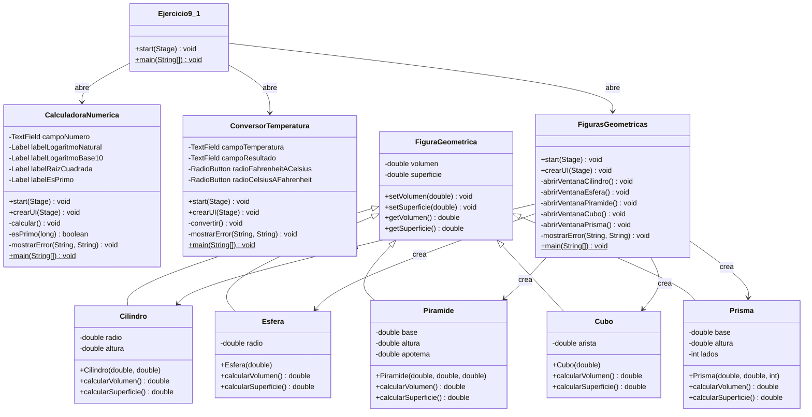
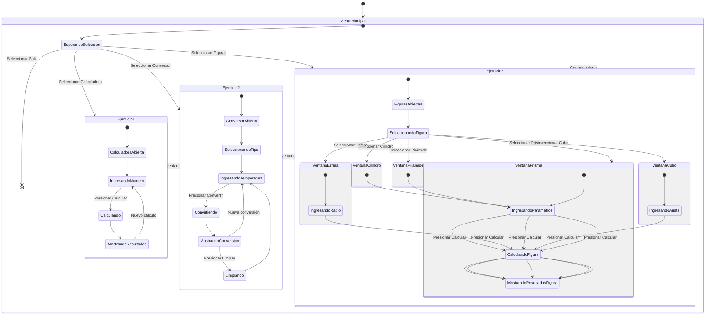

# Documentación - Ejercicio 9.1: Escenarios JavaFX

## Descripción General

Este ejercicio implementa tres aplicaciones JavaFX independientes que demuestran el uso de componentes gráficos, gestión de eventos y creación de interfaces de usuario modernas. Las aplicaciones incluyen:

1. **Calculadora Numérica**: Permite calcular logaritmos, raíz cuadrada y verificar números primos
2. **Conversor de Temperatura**: Convierte entre grados Fahrenheit y Celsius
3. **Figuras Geométricas**: Calcula volumen y superficie de figuras geométricas (implementación del ejercicio 8.3 con JavaFX)

Todas las aplicaciones utilizan JavaFX para crear interfaces gráficas interactivas y demuestran el manejo de eventos, validación de entrada y presentación de resultados.

## Objetivos de Aprendizaje

Al finalizar este ejercicio, el estudiante tendrá la capacidad para:

- Crear ventanas gráficas utilizando JavaFX
- Incorporar componentes gráficos a los contenedores de una ventana gráfica
- Gestionar eventos de usuario mediante handlers de eventos JavaFX
- Validar entrada de datos y manejar excepciones en interfaces gráficas
- Crear aplicaciones JavaFX con múltiples ventanas
- Implementar cálculos matemáticos y presentarlos en interfaces gráficas
- Utilizar componentes JavaFX como TextField, Button, Label, RadioButton, GridPane y VBox

## Casos de Uso

### CU1: Ejecutar Calculadora Numérica
**Actor:** Usuario (Estudiante/Profesor)
**Descripción:** El usuario desea calcular operaciones matemáticas sobre un número ingresado.

**Flujo Principal:**
1. El usuario selecciona "Ejercicio 1: Calculadora Numérica" desde el menú principal
2. El sistema muestra la ventana de la calculadora numérica
3. El usuario ingresa un número en el campo de texto
4. El usuario presiona el botón "Calcular"
5. El sistema valida que el número sea válido y mayor que 0
6. El sistema calcula:
   - Logaritmo natural (ln)
   - Logaritmo en base 10 (log₁₀)
   - Raíz cuadrada (√)
   - Verifica si es un número primo (solo para enteros)
7. El sistema muestra los resultados en la ventana

**Flujos Alternativos:**
- 3a. Si el campo está vacío, el sistema muestra error "Por favor ingrese un número"
- 3b. Si el número es menor o igual a 0, el sistema muestra error "El número debe ser mayor que 0 para calcular logaritmos y raíz cuadrada"
- 3c. Si el formato es inválido, el sistema muestra error "Por favor ingrese un número válido"
- 6a. Si el número no es entero, el sistema indica que la verificación de número primo solo aplica para enteros

### CU2: Convertir Temperatura
**Actor:** Usuario (Estudiante/Profesor)
**Descripción:** El usuario desea convertir una temperatura entre grados Fahrenheit y Celsius.

**Flujo Principal:**
1. El usuario selecciona "Ejercicio 2: Conversor de Temperatura" desde el menú principal
2. El sistema muestra la ventana del conversor
3. El usuario selecciona el tipo de conversión:
   - "Fahrenheit a Celsius" o
   - "Celsius a Fahrenheit"
4. El usuario ingresa la temperatura en el campo correspondiente
5. El usuario presiona el botón "Convertir"
6. El sistema valida que la temperatura sea un número válido
7. El sistema realiza la conversión:
   - Fahrenheit a Celsius: (F - 32) × 5/9
   - Celsius a Fahrenheit: (C × 9/5) + 32
8. El sistema muestra el resultado en el campo de resultado

**Flujos Alternativos:**
- 4a. Si el campo está vacío, el sistema muestra error "Por favor ingrese una temperatura"
- 4b. Si el formato es inválido, el sistema muestra error "Por favor ingrese un número válido"

**Flujo Alternativo - Limpiar Campos:**
1. El usuario presiona el botón "Limpiar"
2. El sistema limpia los campos de temperatura y resultado

### CU3: Calcular Figuras Geométricas
**Actor:** Usuario (Estudiante/Profesor)
**Descripción:** El usuario desea calcular el volumen y superficie de una figura geométrica.

**Flujo Principal:**
1. El usuario selecciona "Ejercicio 3: Figuras Geométricas" desde el menú principal
2. El sistema muestra la ventana principal con cinco botones (Cilindro, Esfera, Pirámide, Cubo, Prisma)
3. El usuario selecciona una figura haciendo clic en su botón correspondiente
4. El sistema abre la ventana específica para la figura seleccionada
5. El usuario ingresa los parámetros requeridos:
   - **Cilindro**: Radio y altura
   - **Esfera**: Radio
   - **Pirámide**: Base, altura y apotema
   - **Cubo**: Arista
   - **Prisma**: Base, altura y número de lados
6. El usuario presiona el botón "Calcular"
7. El sistema valida que todos los campos estén completos y sean válidos
8. El sistema crea una instancia de la figura correspondiente
9. El sistema calcula el volumen y superficie utilizando las fórmulas matemáticas
10. El sistema muestra los resultados formateados en la ventana

**Flujos Alternativos:**
- 7a. Si hay campos vacíos, el sistema muestra error "Campo nulo o error en formato de número"
- 7b. Si el formato numérico es incorrecto, el sistema muestra mensaje de error
- 7c. Si el número de lados del prisma es menor a 3, el sistema muestra error "El número de lados debe ser mayor o igual a 3"

### CU4: Navegación desde Menú Principal
**Actor:** Usuario (Estudiante/Profesor)
**Descripción:** El usuario desea acceder a los diferentes ejercicios desde un menú centralizado.

**Flujo Principal:**
1. El usuario ejecuta la aplicación principal
2. El sistema muestra el menú principal con cuatro opciones:
   - Ejercicio 1: Calculadora Numérica
   - Ejercicio 2: Conversor de Temperatura
   - Ejercicio 3: Figuras Geométricas
   - Salir
3. El usuario selecciona una opción haciendo clic en el botón correspondiente
4. El sistema abre la ventana del ejercicio seleccionado (o cierra la aplicación si selecciona "Salir")

## Estructura del Proyecto

### Clases Principales

#### 1. Ejercicio9_1 (Clase Principal)
- **Propósito**: Menú principal que permite seleccionar y ejecutar cada ejercicio
- **Componentes**: 
  - 4 botones (3 ejercicios + Salir)
  - Layout VBox para organización vertical
- **Métodos**:
  - `start(Stage)`: void - Inicializa la aplicación principal
  - `main(String[])`: void - Punto de entrada

#### 2. CalculadoraNumerica
- **Propósito**: Aplicación para realizar cálculos matemáticos avanzados
- **Componentes**:
  - TextField para entrada numérica
  - Button "Calcular"
  - Labels para mostrar resultados (logaritmo natural, logaritmo base 10, raíz cuadrada, verificación de primo)
  - GridPane para organización
- **Métodos**:
  - `start(Stage)`: void - Inicializa la aplicación
  - `crearUI(Stage)`: void - Crea la interfaz de usuario
  - `calcular()`: void - Realiza los cálculos matemáticos
  - `esPrimo(long)`: boolean - Verifica si un número es primo
  - `mostrarError(String, String)`: void - Muestra mensajes de error

#### 3. ConversorTemperatura
- **Propósito**: Aplicación para convertir entre escalas de temperatura
- **Componentes**:
  - RadioButtons para seleccionar tipo de conversión
  - TextField para temperatura de entrada
  - TextField para resultado (solo lectura)
  - Button "Convertir"
  - Button "Limpiar"
  - GridPane para organización
- **Métodos**:
  - `start(Stage)`: void - Inicializa la aplicación
  - `crearUI(Stage)`: void - Crea la interfaz de usuario
  - `convertir()`: void - Realiza la conversión de temperatura
  - `mostrarError(String, String)`: void - Muestra mensajes de error

#### 4. FigurasGeometricas
- **Propósito**: Aplicación para calcular propiedades de figuras geométricas
- **Componentes**:
  - 5 botones para seleccionar figura (Cilindro, Esfera, Pirámide, Cubo, Prisma)
  - Ventanas modales para cada figura con campos específicos
  - Labels para mostrar volumen y superficie
- **Métodos**:
  - `start(Stage)`: void - Inicializa la aplicación principal
  - `crearUI(Stage)`: void - Crea la interfaz principal
  - `abrirVentanaCilindro()`: void - Abre ventana para cilindro
  - `abrirVentanaEsfera()`: void - Abre ventana para esfera
  - `abrirVentanaPiramide()`: void - Abre ventana para pirámide
  - `abrirVentanaCubo()`: void - Abre ventana para cubo
  - `abrirVentanaPrisma()`: void - Abre ventana para prisma
  - `mostrarError(String, String)`: void - Muestra mensajes de error

#### 5. Clases del Modelo de Datos

##### FiguraGeometrica (Clase Base)
- **Propósito**: Clase base para todas las figuras geométricas
- **Atributos**:
  - `volumen`: double - Volumen de la figura
  - `superficie`: double - Superficie de la figura
- **Métodos**:
  - `setVolumen(double)`: void
  - `setSuperficie(double)`: void
  - `getVolumen()`: double
  - `getSuperficie()`: double

##### Cilindro
- **Atributos**:
  - `radio`: double - Radio del cilindro
  - `altura`: double - Altura del cilindro
- **Métodos**:
  - `Cilindro(double radio, double altura)` - Constructor
  - `calcularVolumen()`: double - Volumen = π × altura × radio²
  - `calcularSuperficie()`: double - Superficie = 2π × radio × altura + 2π × radio²

##### Esfera
- **Atributos**:
  - `radio`: double - Radio de la esfera
- **Métodos**:
  - `Esfera(double radio)` - Constructor
  - `calcularVolumen()`: double - Volumen = (4/3) × π × radio³
  - `calcularSuperficie()`: double - Superficie = 4π × radio²

##### Piramide
- **Atributos**:
  - `base`: double - Base de la pirámide
  - `altura`: double - Altura de la pirámide
  - `apotema`: double - Apotema de la pirámide
- **Métodos**:
  - `Piramide(double base, double altura, double apotema)` - Constructor
  - `calcularVolumen()`: double - Volumen = (base² × altura) / 3
  - `calcularSuperficie()`: double - Superficie = base² + 2 × base × apotema

##### Cubo
- **Atributos**:
  - `arista`: double - Arista del cubo
- **Métodos**:
  - `Cubo(double arista)` - Constructor
  - `calcularVolumen()`: double - Volumen = arista³
  - `calcularSuperficie()`: double - Superficie = 6 × arista²

##### Prisma
- **Atributos**:
  - `base`: double - Base del prisma
  - `altura`: double - Altura del prisma
  - `lados`: int - Número de lados del prisma
- **Métodos**:
  - `Prisma(double base, double altura, int lados)` - Constructor
  - `calcularVolumen()`: double - Volumen = área_base × altura
  - `calcularSuperficie()`: double - Superficie = 2 × área_base + área_lateral

## Diagramas de Clase

### Diagrama de Clases Principal



### Diagrama de Máquina de Estados (Flujo Principal)



## Fórmulas Matemáticas Utilizadas

### Calculadora Numérica
- **Logaritmo natural**: `ln(x) = Math.log(x)`
- **Logaritmo base 10**: `log₁₀(x) = Math.log10(x)`
- **Raíz cuadrada**: `√x = Math.sqrt(x)`
- **Verificación de número primo**: Algoritmo de prueba de divisibilidad hasta √n

### Conversor de Temperatura
- **Fahrenheit a Celsius**: `C = (F - 32) × 5/9`
- **Celsius a Fahrenheit**: `F = (C × 9/5) + 32`

### Figuras Geométricas

#### Cilindro
- **Volumen**: `V = π × altura × radio²`
- **Superficie**: `S = 2π × radio × altura + 2π × radio²`

#### Esfera
- **Volumen**: `V = (4/3) × π × radio³`
- **Superficie**: `S = 4π × radio²`

#### Pirámide
- **Volumen**: `V = (base² × altura) / 3`
- **Superficie**: `S = base² + 2 × base × apotema`

#### Cubo
- **Volumen**: `V = arista³`
- **Superficie**: `S = 6 × arista²`

#### Prisma
- **Volumen**: `V = área_base × altura`
  - Donde `área_base = (lados × base²) / (4 × tan(π/lados))`
- **Superficie**: `S = 2 × área_base + área_lateral`
  - Donde `área_lateral = lados × base × altura`

## Ejecución Esperada

### Calculadora Numérica
**Entrada:** Número = 10
**Salida esperada:**
```
Logaritmo natural: 2.3026
Logaritmo base 10: 1.0000
Raíz cuadrada: 3.1623
¿Es primo?: No
```

**Entrada:** Número = 7
**Salida esperada:**
```
Logaritmo natural: 1.9459
Logaritmo base 10: 0.8451
Raíz cuadrada: 2.6458
¿Es primo?: Sí
```

### Conversor de Temperatura
**Entrada:** 100 °F → Celsius
**Salida esperada:** `37.78 °C`

**Entrada:** 25 °C → Fahrenheit
**Salida esperada:** `77.00 °F`

### Figuras Geométricas
**Cilindro:**
- Radio = 5 cm, Altura = 10 cm
- Volumen esperado: ~785.40 cm³
- Superficie esperada: ~471.24 cm²

**Esfera:**
- Radio = 5 cm
- Volumen esperado: ~523.60 cm³
- Superficie esperada: ~314.16 cm²

**Pirámide:**
- Base = 5 cm, Altura = 10 cm, Apotema = 6 cm
- Volumen esperado: ~83.33 cm³
- Superficie esperada: ~85.00 cm²

**Cubo:**
- Arista = 5 cm
- Volumen esperado: 125.00 cm³
- Superficie esperada: 150.00 cm²

**Prisma:**
- Base = 5 cm, Altura = 10 cm, Lados = 6 (hexagonal)
- Volumen esperado: ~649.52 cm³
- Superficie esperada: ~424.76 cm²

## Validaciones y Manejo de Errores

### Calculadora Numérica
- ✅ Validación de campo vacío
- ✅ Validación de formato numérico
- ✅ Validación de números positivos para logaritmos
- ✅ Manejo de números no enteros para verificación de primos

### Conversor de Temperatura
- ✅ Validación de campo vacío
- ✅ Validación de formato numérico
- ✅ Los valores negativos son aceptados (temperaturas válidas pueden ser negativas)

### Figuras Geométricas
- ✅ Validación de campos vacíos
- ✅ Validación de formato numérico
- ✅ Validación de todos los parámetros requeridos antes del cálculo
- ✅ Validación de número de lados del prisma (debe ser ≥ 3)

## Componentes JavaFX Utilizados

### Contenedores
- **GridPane**: Organización en grilla para formularios
- **VBox**: Organización vertical de componentes
- **HBox**: Organización horizontal (usado internamente por JavaFX)

### Controles
- **Label**: Etiquetas de texto
- **TextField**: Campos de entrada de texto
- **Button**: Botones de acción
- **RadioButton**: Botones de opción (para conversor de temperatura)
- **ToggleGroup**: Agrupación de RadioButtons

### Otros
- **Scene**: Escena que contiene los componentes
- **Stage**: Ventana principal de la aplicación
- **Alert**: Cuadros de diálogo para mensajes de error

## Ejercicios Propuestos Resueltos

### EP1: Calculadora Numérica
- ✅ Cálculo de logaritmo natural
- ✅ Cálculo de logaritmo en base 10
- ✅ Cálculo de raíz cuadrada
- ✅ Verificación de números primos
- **Implementado en:** `CalculadoraNumerica.java`

### EP2: Conversor de Temperatura
- ✅ Conversión de Fahrenheit a Celsius
- ✅ Conversión de Celsius a Fahrenheit
- ✅ Interfaz intuitiva con selección de dirección de conversión
- **Implementado en:** `ConversorTemperatura.java`

### EP3: Figuras Geométricas (Ejercicio 8.3 con JavaFX)
- ✅ Cálculo de volumen y superficie para Cilindro
- ✅ Cálculo de volumen y superficie para Esfera
- ✅ Cálculo de volumen y superficie para Pirámide
- ✅ Cálculo de volumen y superficie para Cubo
- ✅ Cálculo de volumen y superficie para Prisma
- ✅ Interfaz gráfica con JavaFX
- **Implementado en:** `FigurasGeometricas.java` y clases del modelo

## Cómo compilar y ejecutar

### Prerrequisitos
- Java 17 o superior
- Apache Maven 3.8 o superior
- JavaFX 21 (incluido como dependencia Maven)

### Compilación
```bash
cd Evaluacion6/Ejercicio9_1
mvn clean compile
```

### Ejecución del menú principal
```bash
mvn -q exec:java -Dexec.mainClass="unal.ejercicio9_1.Ejercicio9_1"
```

### Ejecución de ejercicios individuales

**Calculadora Numérica:**
```bash
mvn -q exec:java -Dexec.mainClass="unal.ejercicio9_1.CalculadoraNumerica"
```

**Conversor de Temperatura:**
```bash
mvn -q exec:java -Dexec.mainClass="unal.ejercicio9_1.ConversorTemperatura"
```

**Figuras Geométricas:**
```bash
mvn -q exec:java -Dexec.mainClass="unal.ejercicio9_1.FigurasGeometricas"
```

### Ejecución desde NetBeans
1. Abrir el proyecto: `File → Open Project...`
2. Seleccionar la carpeta `Ejercicio9_1`
3. Ejecutar con `Run Project` o presionar F6
4. Seleccionar el ejercicio deseado desde el menú principal

## Notas Técnicas

### Arquitectura JavaFX
- Todas las clases principales extienden `Application`
- Cada aplicación puede ejecutarse independientemente mediante su método `main()`
- El menú principal crea instancias de cada aplicación y muestra sus ventanas en Stages separados

### Gestión de Eventos
- Uso de expresiones lambda para handlers de eventos: `e -> accion()`
- Los eventos se gestionan mediante `setOnAction()` en botones
- Validación en tiempo de ejecución antes de realizar cálculos

### Manejo de Excepciones
- Uso de `try-catch` para validar entrada numérica
- Mensajes de error claros mediante `Alert` de JavaFX
- Validación proactiva de campos antes de procesamiento

### Diseño de Interfaz
- Estilos CSS inline para bordes y padding
- Layouts responsivos con GridPane y VBox
- Campos de resultado en modo solo lectura para prevenir edición

## Extensiones Posibles

- Agregar más figuras geométricas (Cubo, Prisma, Cono, etc.)
- Implementar historial de cálculos
- Guardar resultados en archivo
- Agregar gráficas para visualizar resultados
- Implementar tema oscuro/claro
- Agregar más conversiones de temperatura (Kelvin)
- Implementar cálculo de logaritmos en diferentes bases
- Agregar visualización gráfica de figuras geométricas


